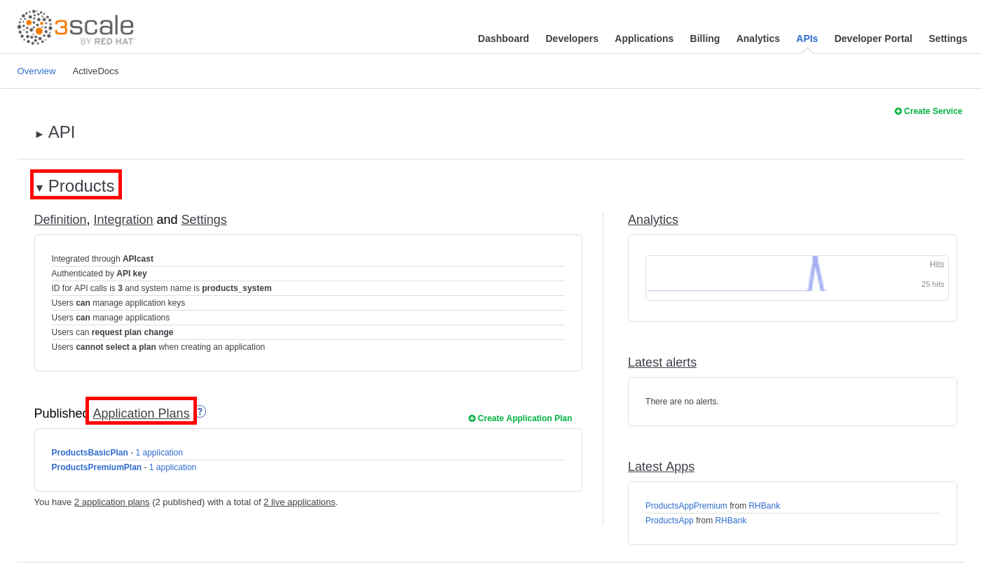
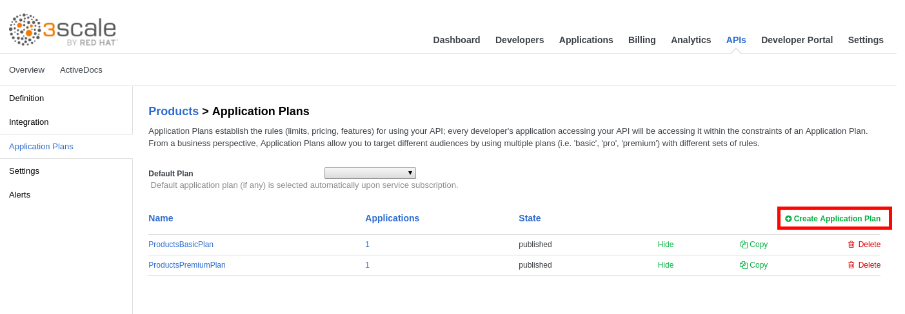
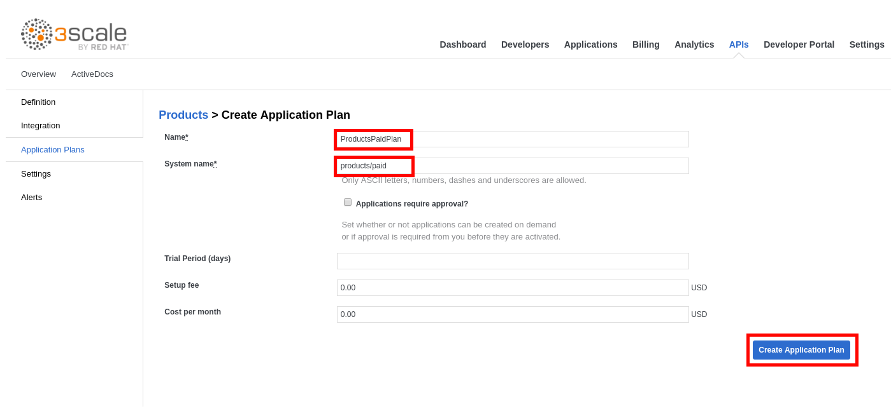
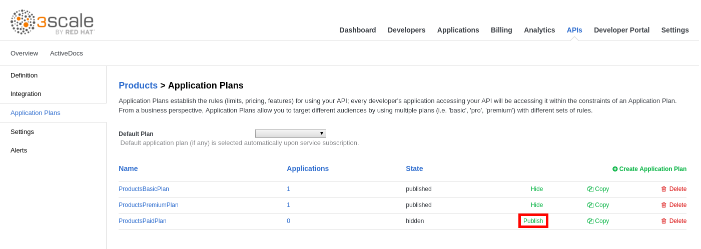
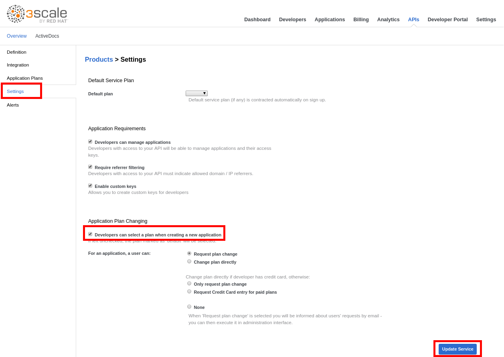
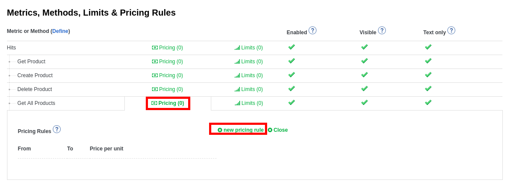
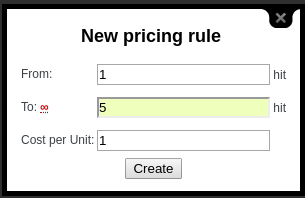

# Lab 9 - Monetization


In this lab you will explore the monetization feature of 3scale API Management.


* Go to https://3scale-admin.3scale.{{ book.suffix }}
* Login as admin/admin
* Click on the **APIs** tab.
* Expand the **Products** API.
* Click on the **Application Plans** link.

* Click on the **Create Application Plan** link.

* Enter the following values:
    * **Name**: ProductsPaidPlan
    * **System Name**: products/paid
* Click on the **Create Application Plan** button.   


Note that you could also set things like a **Trial Period**, **Setup fee** and **Monthly Cost**


* Click on **Publish**.

* Click on the **Settings** tab.
* Check the **Developers can select a plan when creating a new application** checkbox under **Application Plan Changing**.
* Click on the **Update Service** button.

* Click on **ProductsPaidPlan**.
* Click on **Pricing** next to **Get All Products**.
* Click on **new pricing rule**.

* Enter the following values:
    * **From**: 1
    * **To**: 5
    * ** Cost per unit**: 1
* Click on the **Create** button.

* 

