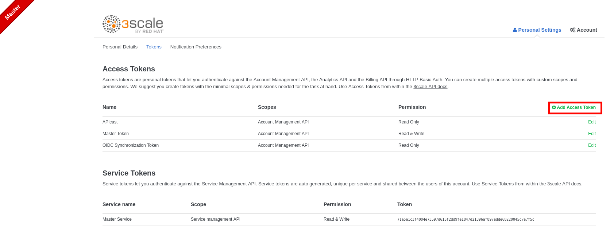
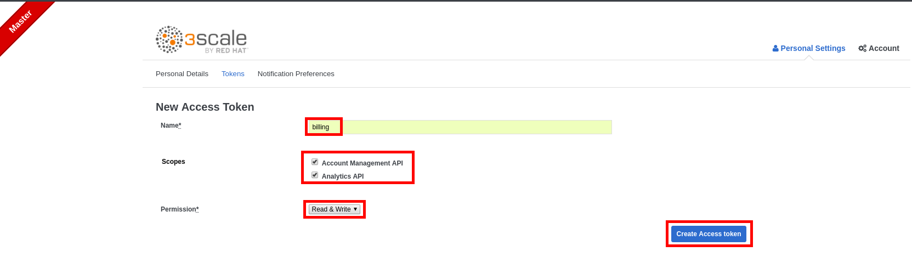
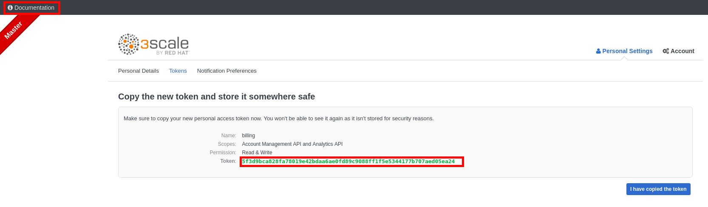
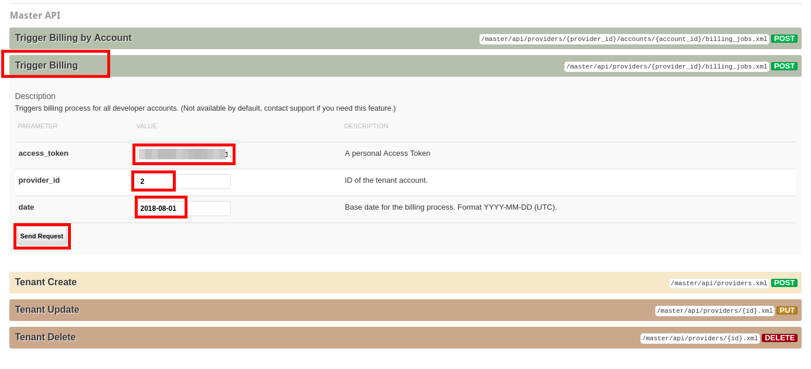
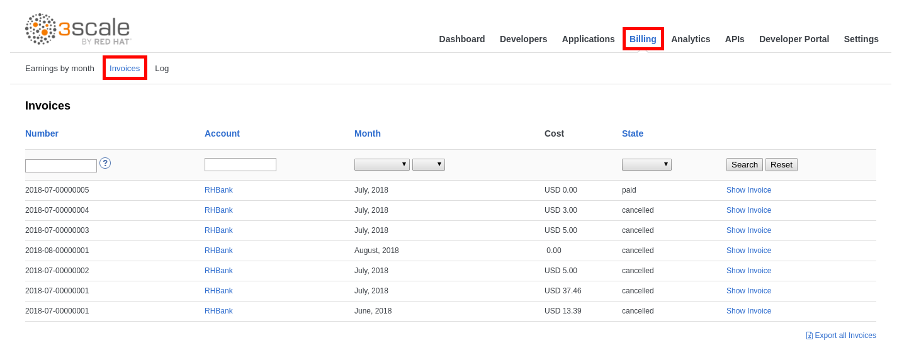
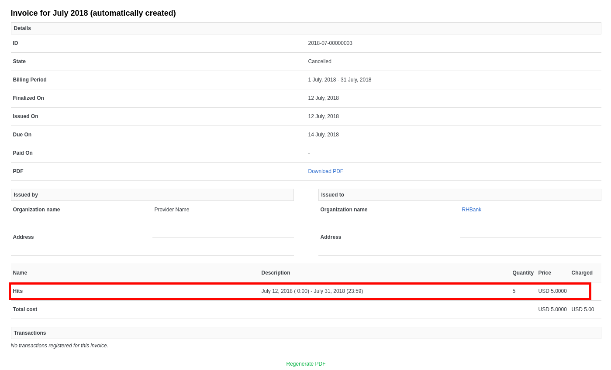

## Execute Monthly Billing


Now you will force the execution of the monthly billing to see how it works. (normally it would happen automatically once a month)


* Go to https://master-admin.3scale.{{ book.suffix }}/p/admin/user/access_tokens
* Login as master/master


You will access the **Master Tenant** wich is the admin console for the super admin, that manages all the created _tenants_.


* Click on **Add Access Token**.

* Enter **Name**: billing
* Select the two available scopes: **Account Management API** and** Analytics API**
* Select **Read&Write**.
* Click on the **Create Access token** button.

* Copy the generated **Token** and paste it in a text editor (notepad, etc.)
* Click on **Documentation** -> **3scale API Docs**.

* Scroll down to the bottom of the page.
* Click on the **Trigger Billing** API.
* Enter the following values:

| Paramter | Value |
| --- | --- |
| **access_token** | &lt;paste token here&gt; |
| **provider_id** | 2 |
| **date** | &lt;current year, four digits&gt;-&lt;NEXT month, two digits&gt;-01 |


So if today is 10th of July 2018, date should be: 2018-08-01


* Click on the **Send Request** button.

* Close the **Master Tenant** browser tab.
* Go back to the 3scale admin console.
* Click on the **Billing** tab.
* Click on the **Invoices** tab.

* Click on **Show Invoice**.
* Scroll down to the bottom of the invoice.


You should see the 5 request charged USD 1 each.



The invoices could be paid directly in the platform when configured to be integrated with a payment gateway like **Braintree**, **Adyen** or **Stripe**. More info in the [documentation](https://access.redhat.com/documentation/en-us/red_hat_3scale/2.2/html/billing/).

