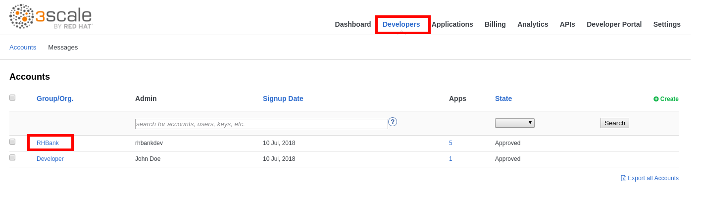
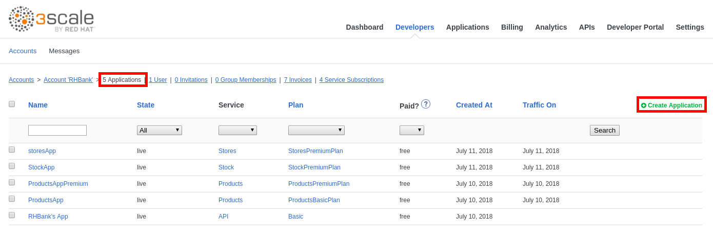
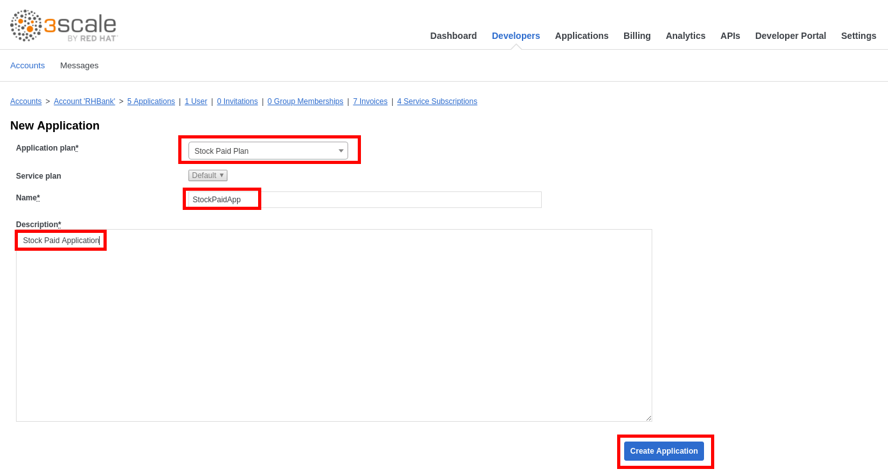
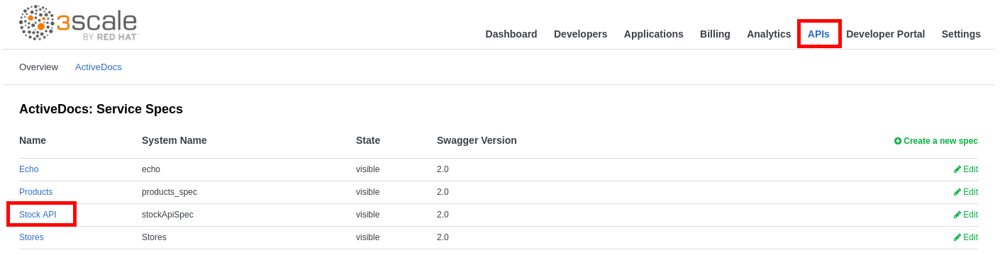
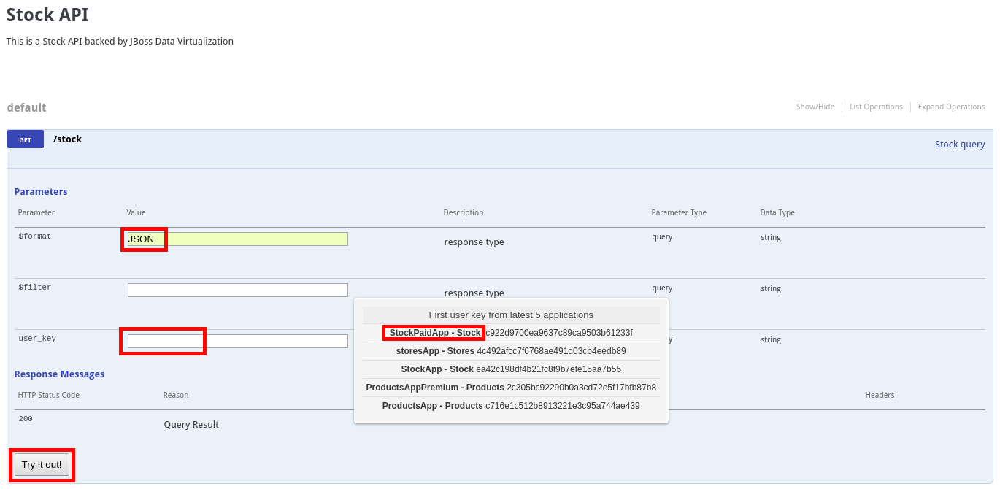

## Create an Application

* Click on the **Developers** tab.
* Click on the **RHBank** account.

* Click on the **5 Applications** breadcrumb.
* Click on the **Create Application**.

* Enter the following values:
    * **Application Plan**: StockPaidPlan
    * **Name**: StockPaidApp
    * **Description**: Stock Paid Application
* Click on the **Create Application**.

* Click on the **APIs** tab.
* Click on the **ActiveDocs** tab.
* Click on the **Stock** doc.

* Expand the **GET /stock** operation.
* Enter "**$format**": JSON
* Click on the **user_key** field and select the **StockPaidApp** user key.
* Click on the **Try it Out!** button.

 
 
 * Click the **Try it Out!** button 4 more times.
 
 
 

