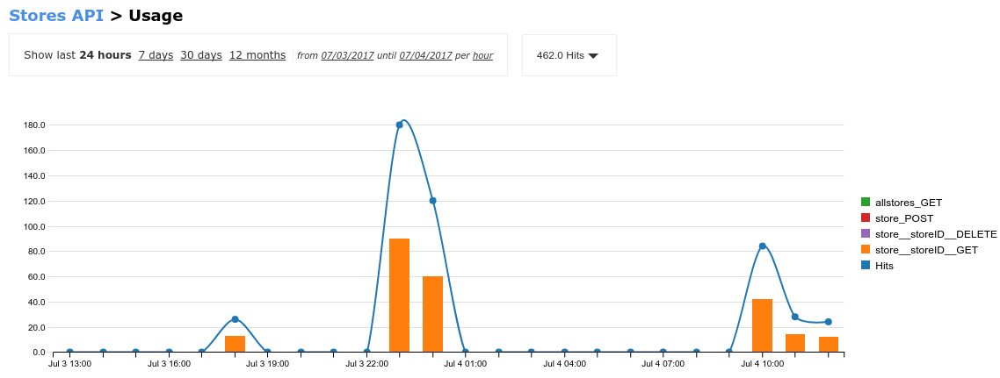

## Test the sample application


Now that the sample application is deployed and the APIs are available, you are going to simulate a web app consuming your APIs.


* Open a new web browser tab and go to http://benefits.{{ book.suffix }}
* Click on any Product from the products table.


It should invoke the Stock API to query about stores with stock available for that products, and invoke the Stores API to retrieve their name/location.


* You can review the nodejs code of the Benefits App here: [https://github.com/pszuster/3ScaleTD/blob/master/Benefits/views/index.html](https://github.com/pszuster/3ScaleTD/blob/master/Benefits/views/index.html)
* Switch back to the 3Scale dashboard’s browser tab.
* Click on the **Analytics** tab.
* Click on the **Products** API, **Stores** API and **Stock** API.
* You should see the traffic created by the **Benefits** application (specifically for the “**Get All Products**”, “**store_storeID_GET**” and stock “**Hits**” operations.

* Go back to the Developer Portal (https://3scale.3scale.{{ book.suffix }})
* Login as dev1/password.
* Click on the **Statistics** tab.
* Cycle through the involved applications to view the API activity (ProductsApp, StoresApp, StockApp).

