# Lab 10 - Securing APIs with OAuth2 {#lab-10-securing-apis-with-oauth2}

|  | In this lab you will modify the first API to use OAuth as the authentication mechanism, using a RH Single Sign-ON instance running in the same OCP cluster. |
| --- | --- |

1.  Open a web browser and go to [https://3scale-admin.3scale[your instance #].rhtechofficelatam.com](https://www.google.com/url?q=https://3scale-admin.3scale1.rhtechofficelatam.com&sa=D&ust=1530635179461000) 
2.  Login as admin/admin
3.  Click on the APIs tab.
4.  Click on the Integration tab under Products.

1.  Click on the edit integration settings link.

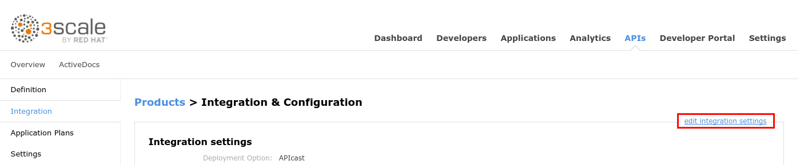

1.  Scroll down to the bottom of the page and select OAuth 2.0 as authentication method.
2.  Click on the Update Service button and accept the warning.

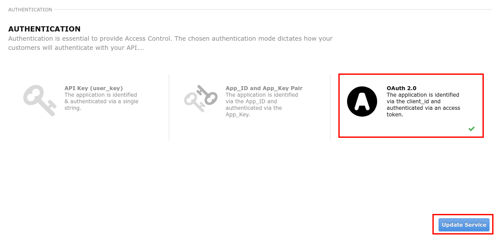

1.  Click on the  edit APIcast configuration link.

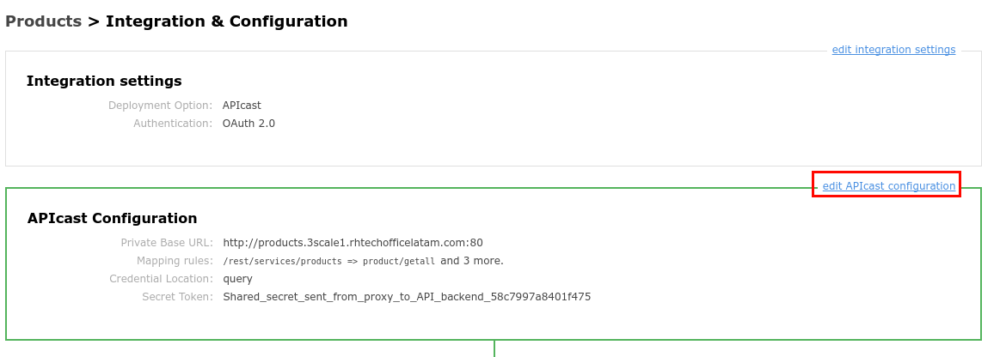

1.  Scroll down to the bottom of the page, and click on the Update the Staging Environment button.
2.  Scroll down to the bottom of the page, and click on the  Back to Integration &amp; Configuration link.
3.  Click on the Promote v XX to Production.
4.  Click on the Developers tab.
5.  Click on the RHBank account.

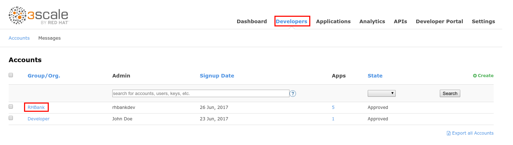

1.  Click on the 5 Applications breadcrumb.
2.  Click on the Create Application link.

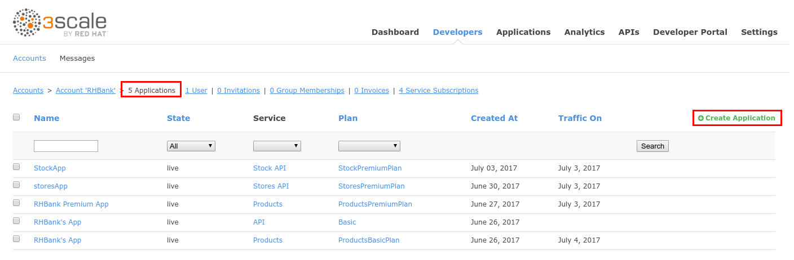

1.  Enter the following values:

1.  Application Plan: ProductsPremiumPlan
2.  Name: OAuthApp
3.  Description: Oauth Application

1.  Click on the Create Application button.

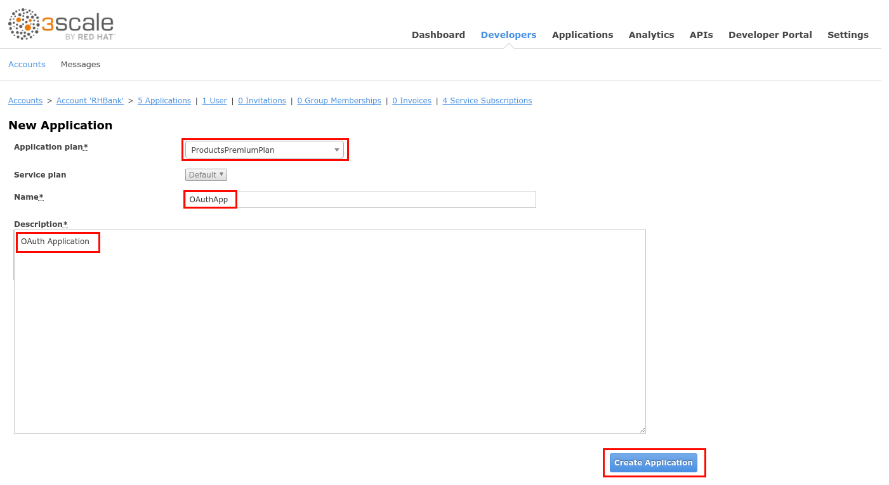

1.  Click on the Change link under  API Credentials.

1.  Enter “[https://www.getpostman.com/oauth2/callback](https://www.google.com/url?q=https://www.getpostman.com/oauth2/callback&sa=D&ust=1530635179466000)” and click on the Update button.

1.  Open a new web-browser tab and go to [https://secure-sso.3scale[your instance #].rhtechofficelatam.com/auth/admin](https://www.google.com/url?q=https://secure-sso.3scale1.rhtechofficelatam.com/auth/admin&sa=D&ust=1530635179467000) 
2.  Login as admin/admin
3.  Click on Realm Settings menu.
4.  Click on the Login tab.
5.  Set Require SSL to none.
6.  Click on the Save button.

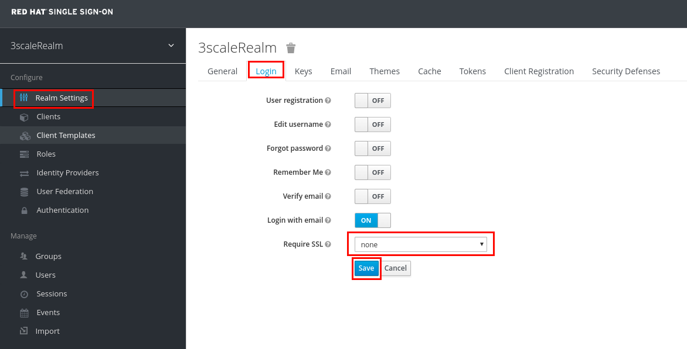

1.  Click on the Clients menu (left of the screen).
2.  Click on the Create button.

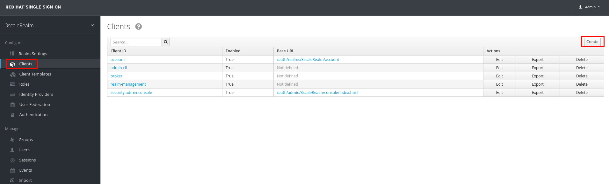

1.  Switch back to the 3Scale admin console.
2.  Select and copy the Client ID of the OAuthApp application.

1.  Go back to the RH-SSO web browser tab.
2.  Paste the Client ID in the Client ID field.
3.  Click on the Save button.

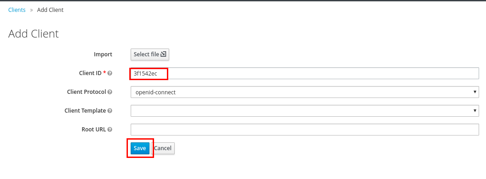

1.  Enter “[https://www.getpostman.com/oauth2/callback](https://www.google.com/url?q=https://www.getpostman.com/oauth2/callback&sa=D&ust=1530635179470000)” in the Valid Redirect URI field.
2.  Click on the Save button.

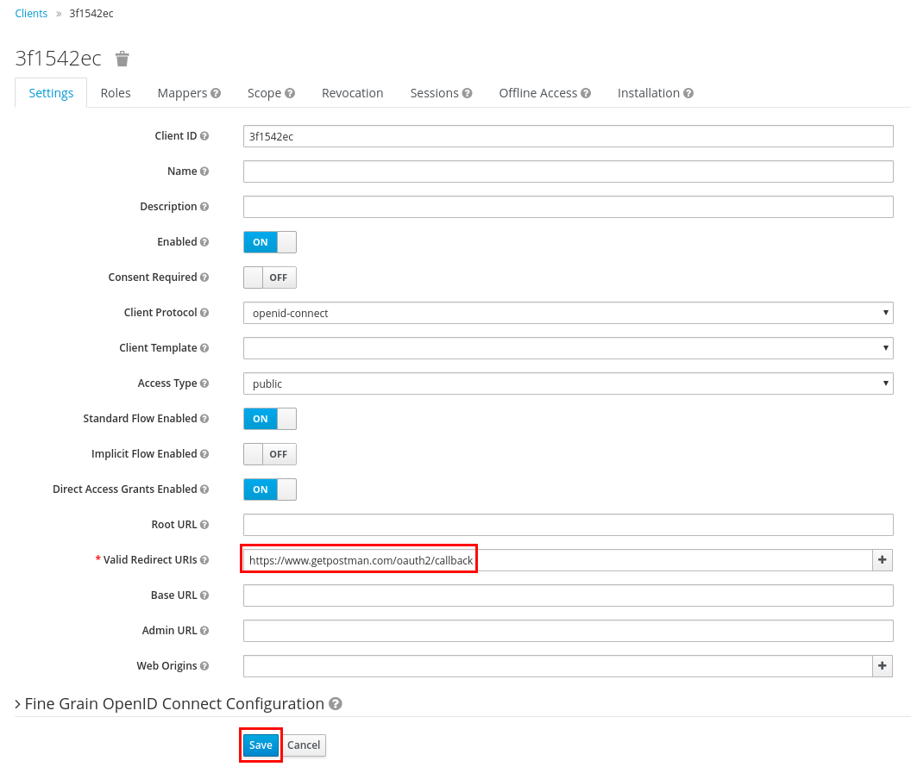

1.  Click on the Users menu.
2.  Click on the Add user button.

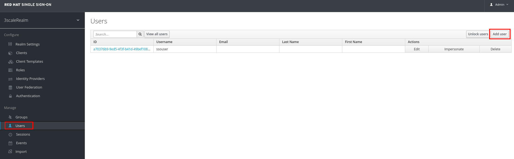

1.  Enter “user1” as Username.
2.  Click on the Save button.

1.  Click on the Credentials tab.
2.  Enter “password” as the New Password and Password Confirmation.
3.  Set Temporary  to OFF.
4.  Click on the Reset Password button.

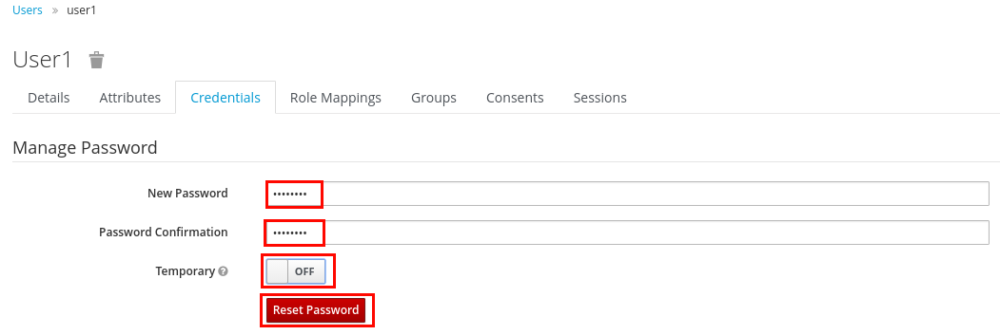

1.  Click on the Change Password button in the confirmation dialog.
2.  Open Postman.
3.  In a new tab, select GET as the verb.
4.  Enter the following URL: [https://products-apicast-production.gateway.3scale[your instance #].rhtechofficelatam.com/rest/services/product/1](https://www.google.com/url?q=https://products-apicast-production.gateway.3scale1.rhtechofficelatam.com/rest/services/product/1&sa=D&ust=1530635179473000) 
5.  Click on the Authorization tab.
6.  Select OAuth 2.0 as the Type.
7.  Click on the Get new access token button.

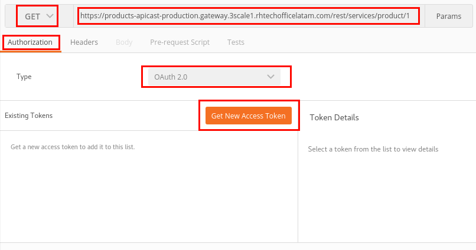

1.  Enter the following values:

1.  Token Name: products
2.  Auth URL: [https://products-apicast-production.gateway.3scale[your instance #].rhtechofficelatam.com:443/authorize](https://www.google.com/url?q=https://products-apicast-production.gateway.3scale1.rhtechofficelatam.com:443/authorize&sa=D&ust=1530635179474000) 
3.  Access Token URL: [https://products-apicast-production.gateway.3scale[your instance #].rhtechofficelatam.com:443/oauth/token](https://www.google.com/url?q=https://products-apicast-production.gateway.3scale1.rhtechofficelatam.com:443/oauth/token&sa=D&ust=1530635179475000) 
4.  Client ID: Copy+Paste it from the API Credentials section of the OAuthApp.
5.  Client Secret: Copy+Paste it from the API Credentials section of the OAuthApp.
6.  Grant Type: Authorization Code.
7.  Request access token locally: checked.

1.  Click on the Request Token button.

1.  In the 3ScaleRealm login window, enter user1/passowrd and click on the Log in button.

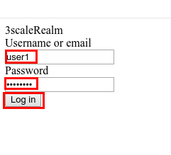

1.  Click on the products token.
2.  Click on the Use Token button.
3.  Click on the Send button.

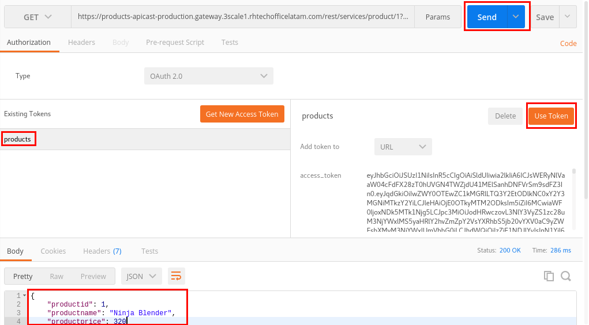

1.  You should receive the Products API response.