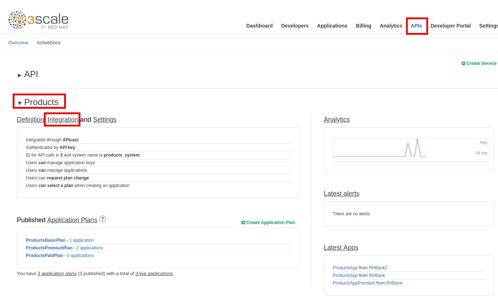

## Secure an API using OpenID Connect

* Go back to **3scale admin console** (https://3scale-admin.3scale.{{ book.suffix }}.
* Login as admin/admin.
* Click on the **APIs** tab.
* Expand the **Products** API.
* Click on **Inregration**.

* Click on **edit integration settings**.

