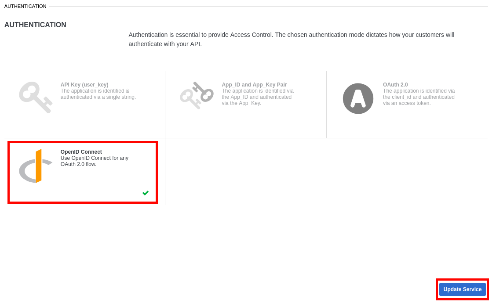
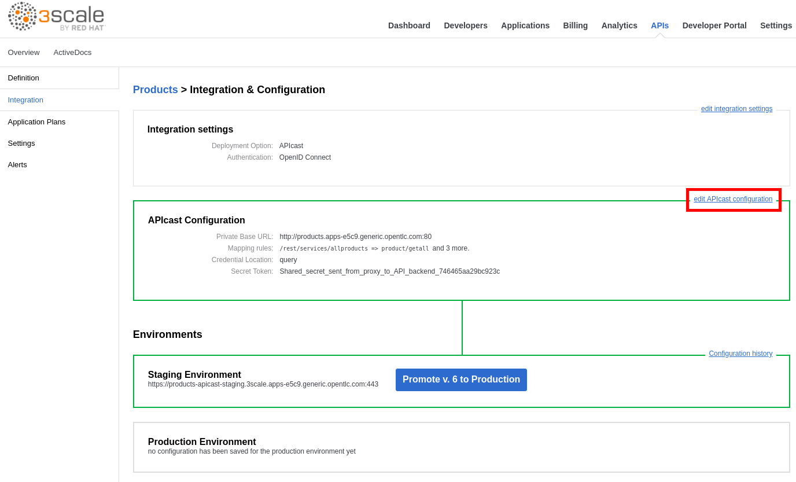
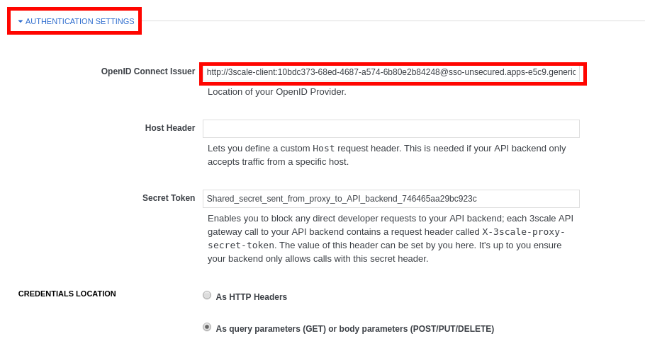
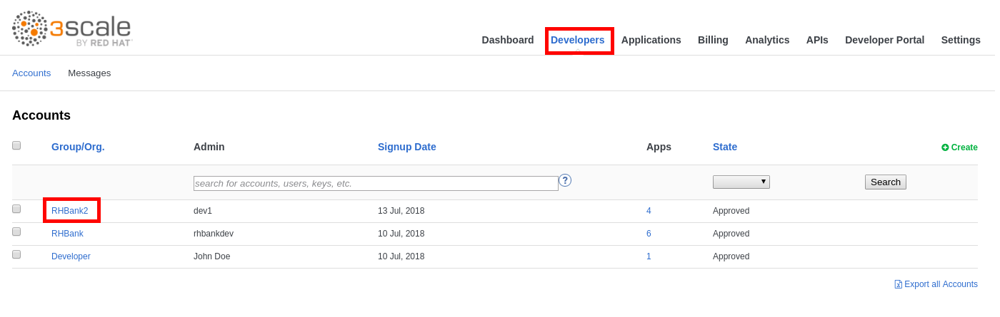
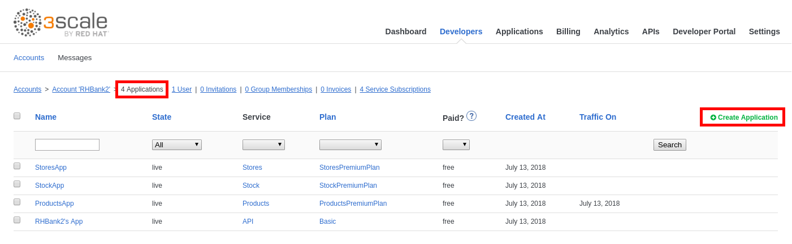
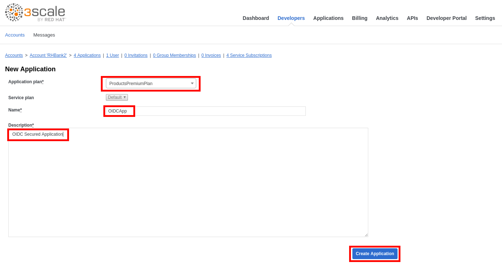

## Secure an API using OpenID Connect

* Go back to **3scale admin console** (https://3scale-admin.3scale.{{ book.suffix }}.
* Login as admin/admin.
* Click on the **APIs** tab.
* Expand the **Products** API.
* Click on **Inregration**.

* Click on **edit integration settings**.

* Scroll down to the bottom of the page.
* Click on **OpenID Connect**.
* Click on the **Update Service** button.
* Accept the warning.

* Click on **edit APIcast configuration**.

* Expand the **Authentication Settings** section.
* Enter the following value for the **OpenID Conect Issuer**: http://3scale-client:&lt;Paste your CLIENT SECRET&gt;@sso-unsecured.{{ book.suffix }}/auth/realms/3scaleRealm

* Scroll down to the bottom of the page.
* Click on the **Update the Staging Environment** button.
* Click on the **Back to Integration & Configuration** link.
* Click on the **Promite v.X to Production**.
* Click on the **Developers** tab.
* Click on the **RHBank2** account.

* Click on the **4 Applications** breadcrumb link.
* Click on **Create Application**.

* Enter the following values:

| Parameter | Value |
| --- | --- |
| **Application Plan** | ProductsPremiumPlan |
| **Name** | OIDCApp |
| **Description** | OIDC Secured Application |

* Click on the **Create Application** button.

