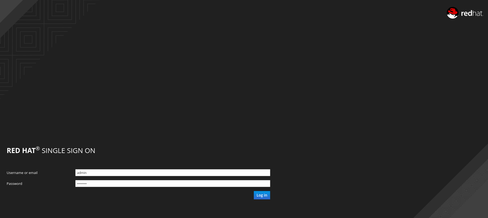

## Setup Red Hat Single Sign-on


In this part of the lab, you will setup all the required configurations to make RH-SSO work with 3scale API Management.


* Go to **https://sso.{{ book.suffix }}/auth/admin**
* Accept the self-signed SSL certificate.
* Login as **admin/passwod**.

