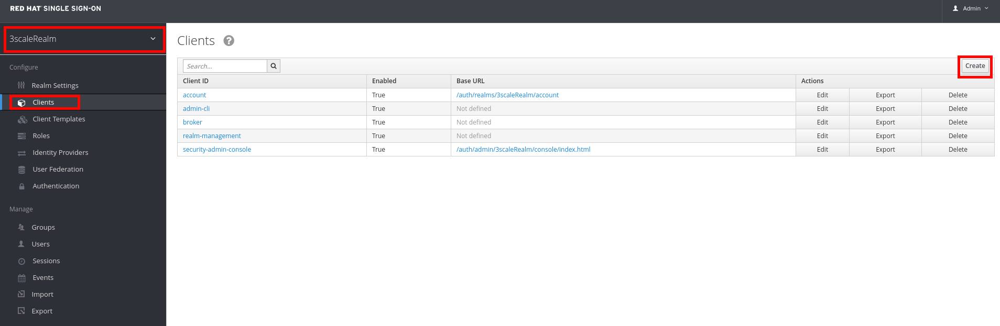
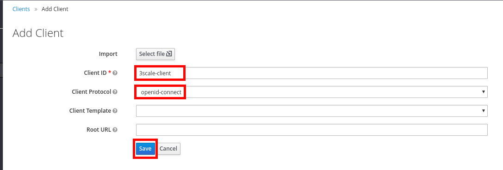
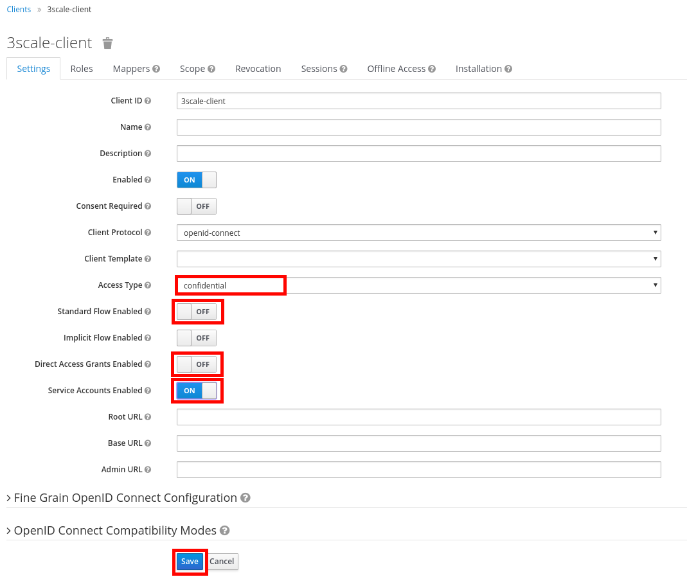
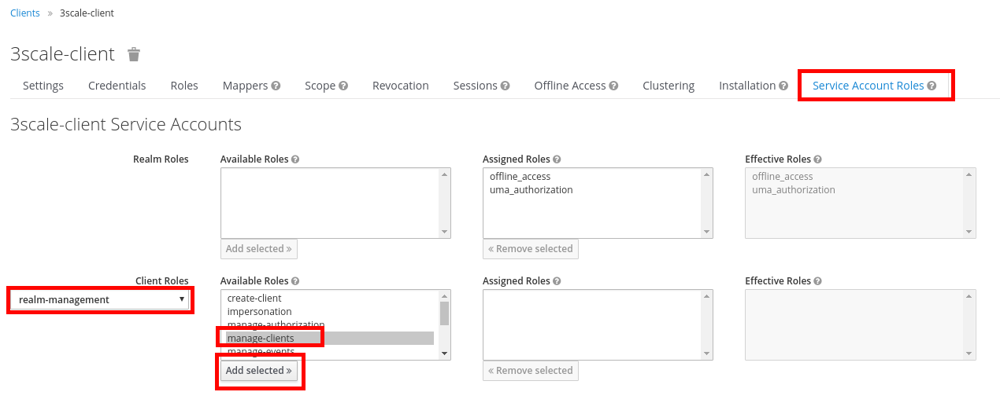
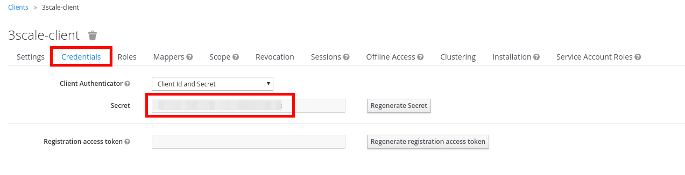

## Setup Red Hat Single Sign-on


In this part of the lab, you will setup all the required configurations to make RH-SSO work with 3scale API Management.


* Go to **https://sso.{{ book.suffix }}/auth/admin**
* Accept the self-signed SSL certificate.
* Login as **admin/passwod**.

* Make sure the **3scaleRealm** realm is selected.
* Click on **Clients**.
* Click on the **Create** button.

* Enter the following values:
    * **Client ID**: 3scale-client
    * **Client Protocol**: openid-connect
* Click on the **Save** button.

* Set the following parameters:

| Parameter | Value |
| --- | --- |
| **Access Type** | confidential |
| **Standard Flow Enabled** | OFF |
| **Direct Access Grants Enabled** | OFF |
| **Service Accounts Enabled** | ON |

* Click on the **Save** button.

* Click on the **Service Account Roles** tab.
* Select **realm-management** in the **Client Roles** drop-down.
* Select **manage-clients** in the **Available Roles** list.
* Click on the **Add selected >>** button.

* Click on the **Credentials** tab.
* Take note of the **Secret**, you will need it later.

