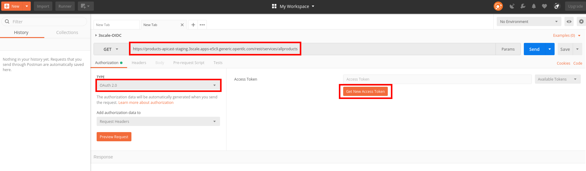
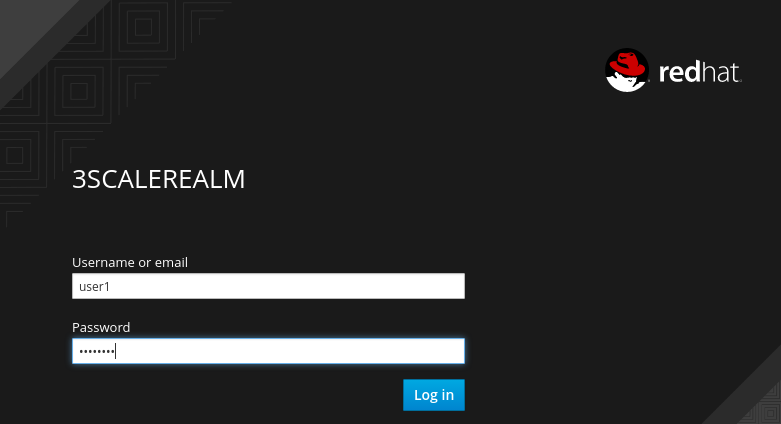
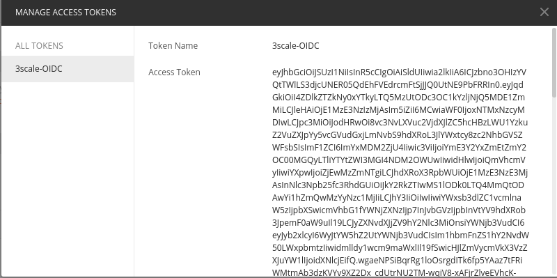
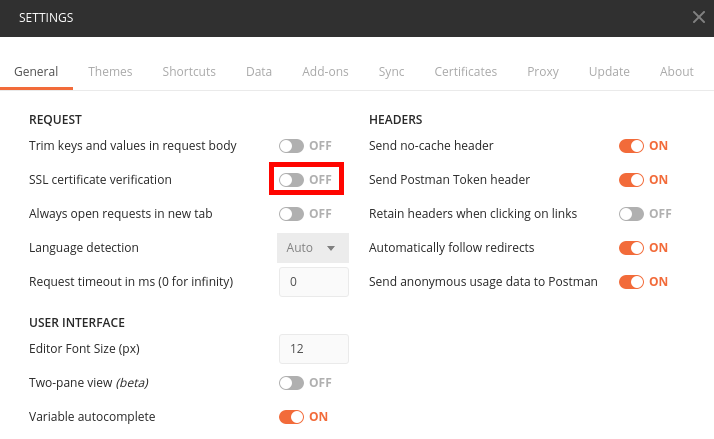
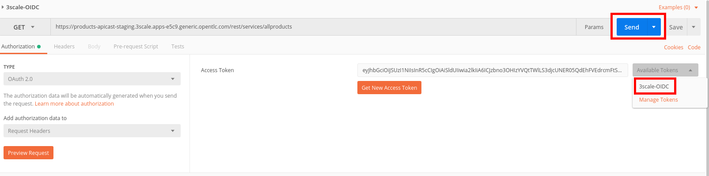

## Test Secured API


Now that RH-SSO is ready and the API has been secured in 3scale, you will test it.


* If you already don't have it, install Postman (https://www.getpostman.com/apps)
* Create a new Request and Collection.

* Enter https://products-apicast-staging.3scale.{{ book.suffix }}/rest/services/allproducts as the **URL**.
* Select **OAuth 2.0** from the **Type** dropdown, under the **Authorization** section.
* Click on the **Get New Access Token** button.

* Enter the following values:

| Parameter | Value |
| --- | --- |
| **Token Name** | 3scale-OIDC |
| **Auth URL** | http://sso-unsecured.{{ book.suffix }}/auth/realms/3scaleRealm/protocol/openid-connect/auth |
| **Access Token URL** | http://sso-unsecured.{{ book.suffix }}/auth/realms/3scaleRealm/protocol/openid-connect/token |
| **Client ID** | &lt;Paste the Client ID from the Application created in 3scale&gt; |
| **Client Secret** | &lt;Paste the Client Secret from the Application created in 3scale&gt; |
| **Grant Type** | Authorization Code |

* Click on the **Request Token** button.

* A RH-SSO screen should pop up.
* Login as **user1/password**.

* You should get a new token.

* Close the token window.
* Select the "3scaleOIDC" token from the **Available Tokes** drop-down.

* Click on the **Send** button.


You should receive a successful response from the API.


