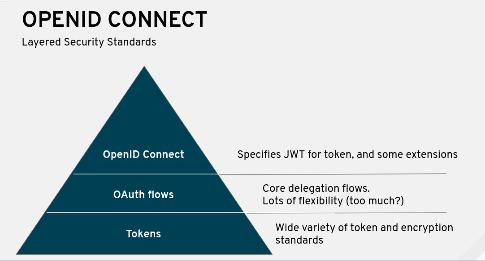

# Lab 11 - Securing APIs with OpenID Connect {#lab-11-securing-apis-with-oidc}


In this lab you will modify the first API to use **OpenID Connect** (OIDC) as the authentication mechanism, using a [Red Hat Single Sign-ON](https://access.redhat.com/products/red-hat-single-sign-on) instance running in the same OCP cluster.

**OpenID Connect 1.0** is a simple identity layer on top of the OAuth 2.0 protocol. It allows Clients to verify the identity of the End-User based on the authentication performed by an Authorization Server, as well as to obtain basic profile information about the End-User in an interoperable and REST-like manner.

**OpenID Connect** allows clients of all types, including Web-based, mobile, and JavaScript clients, to request and receive information about authenticated sessions and end-users. The specification suite is extensible, allowing participants to use optional features such as encryption of identity data, discovery of OpenID Providers, and session management, when it makes sense for them.



OpenID is an open standard for authentication. A user must obtain an OpenID account through an OpenID identity provider (for example, Google). The user will then use that account to sign into any website (the relying party) that accepts OpenID authentication.

OAuth2 is an open standard for authorization. Confusingly, OAuth2 is also the basis for OpenID Connect. OAuth2 provides secure delegated access, meaning that an application, called a client, can take actions or access resources on a resource server on the behalf of a user, without the user sharing their credentials with the application.
