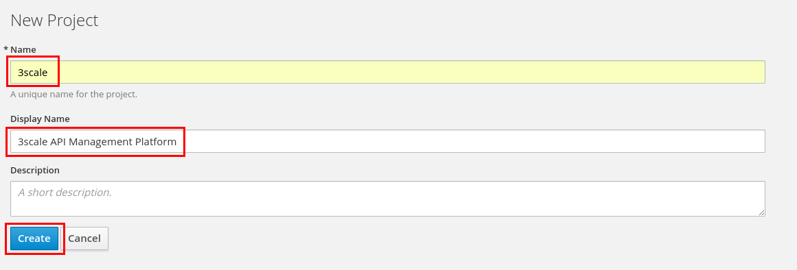
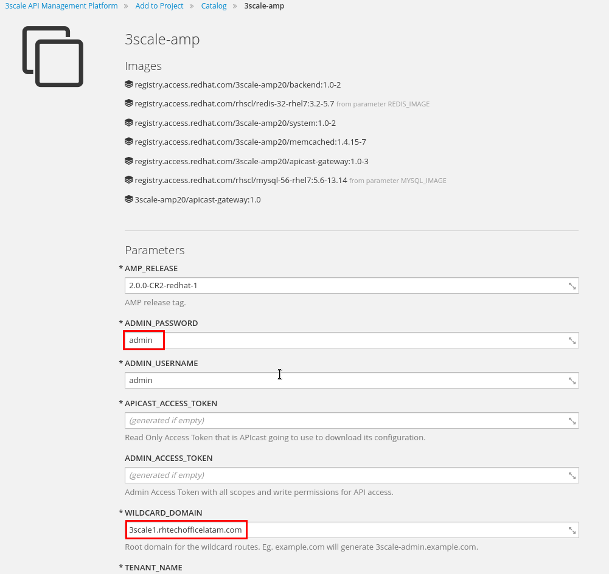

# Lab 1 - Installation {#lab-1-installation}

|  | In this lab, you will deploy a Red Hat 3Scale API Management Platform (AMP) instance to an Openshift Container Platform (OCP) cluster. |
| --- | --- |

1.  Open a web browser and go to https://threescale.3scale[your instance #].rhtechofficelatam.com:8443 
2.  Login as admin/admin.
3.  Click on the New Project button

1.  Enter the following values:

1.  Name: 3scale
2.  Display Name: 3Scale API Management Platform

1.  Click on the Create button.

1.  In the “Add to Project” wizard, search for “3scale”.
2.  Click on the Select button under 3scale-amp.

1.  Enter the following values:

1.  ADMIN_PASSWORD: admin
2.  WILDCARD_DOMAIN: 3scale[your instance #].rhtechofficelatam.com
3.  RHSSO_ENDPOINT: [https://secure-sso.3scale[your instance #].rhtechofficelatam.com/auth/realms/3scaleRealm](https://www.google.com/url?q=https://secure-sso.3scale1.rhtechofficelatam.com/auth/realms/3scaleRealm&sa=D&ust=1530635179290000) 

1.  Scroll down to the bottom and click on the Create button.
2.  Click on the Continue to overview link.

1.  After ~5 minutes, all the pods should have a blue circle, meaning 3Scale AMP is up and running.

