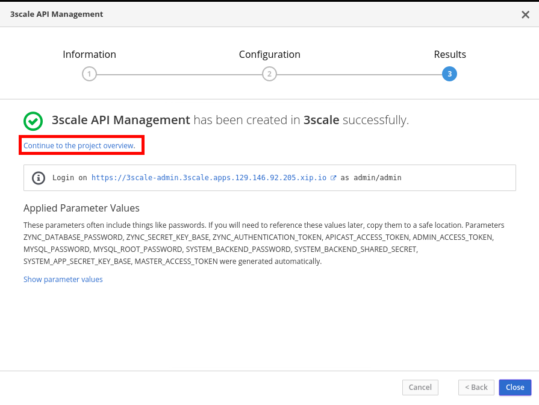
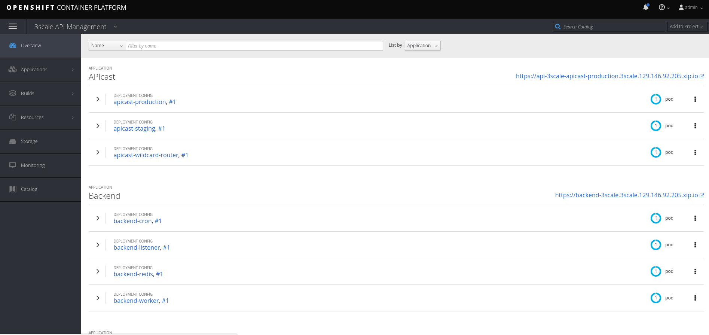

# Lab 1 - Installation {#lab-1-installation}


In this lab, you will deploy a Red Hat 3Scale API Management Platform \(AMP\) instance to an Openshift Container Platform \(OCP\) cluster. 


* Open a web browser and go to https://{{ book.hostname }}:8443 
* Expand the **Advanced** link and click on the **Proceed to {{ book.hostname }}** link.

* Login as admin/admin.
* Click on the **3scale API Management **icon in the Catalog.

* Click **Next &gt;.**
* Select **Create Project**.
* Enter the following values:

| Parameter | Value |
| :--- | :--- |
| **Project Name** | 3scale |
| **Project Display Name** | 3scale API Management |

* Scroll down and complete the following values:

| Parameter | Value |
| --- | --- |
| ADMIN\_PASSWORD | admin |
| WILDCARD\_DOMAIN | 3scale.{{ book.suffix }} |
| MASTER\_PASSWORD | master |

* Click on the **Create** button.

* Click on the "**Continue to the project overview"** link.

* After ~5 minutes, all the pods should have a blue circle, meaning 3Scale AMP is up and running.

If you want to learn more about **Openshift** you can check these resources:

* https://www.openshift.com/learn/what-is-openshift/
* https://www.openshift.com/learn/get-started/
* https://learn.openshift.com/

<iframe width="900" height="506" src="https://www.youtube.com/embed/D_Lj0rObunI" frameborder="0" allow="autoplay; encrypted-media" allowfullscreen></iframe>

