# Lab 2 - Create your first API {#lab-2-create-your-first-api}


In this lab, you will create your first API in 3Scale API Management, exposing a REST JEE application which is running in a JBoss Enterprise Application Platform (EAP) container in the same OCP cluster.


* Open a new web browser tab.
* Go to https://3scale-admin.3scale.{{ book.suffix }}.
* Login as admin/admin
* If a "_connection not private_" warning appears, click on **Proceed to ..**
* Login with admin/admin.

* Click on the grey **X** to dismiss the Getting started wizard.


Notice there is a pre-built API called “API” that is useful for learning/testing only.


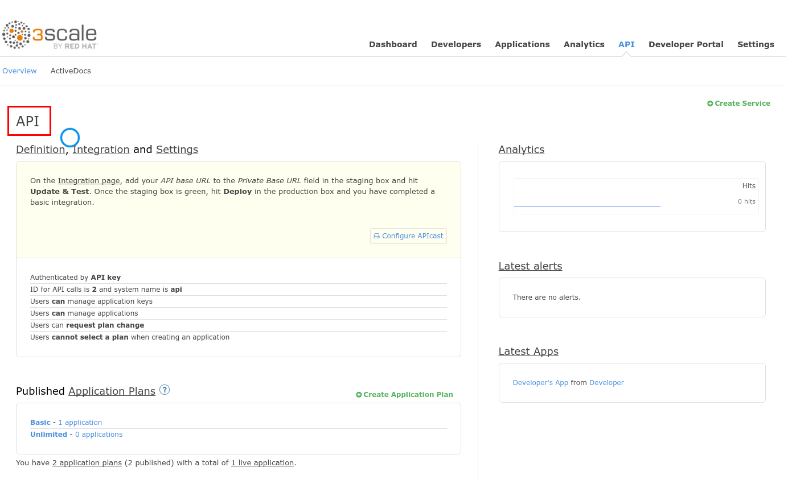

* Click on the **APIs** tab.
* Expand the **Products** API and click on **Integration**.

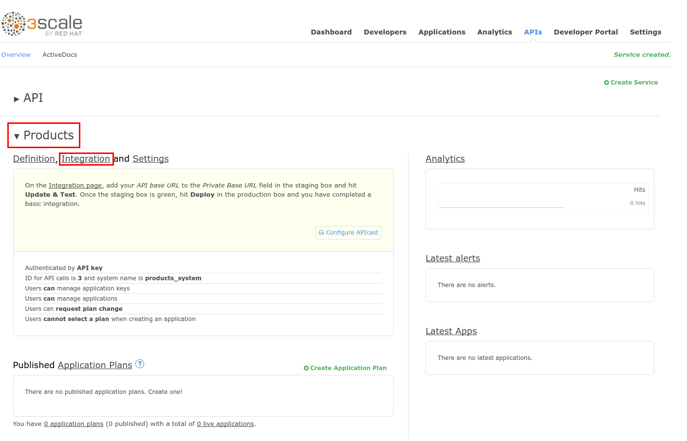

* Click on the **add the base URL of your API and save the configuration** button.

* Expand the **Mapping Rules** section.
* Click on the **Define Metric/Method**  link.

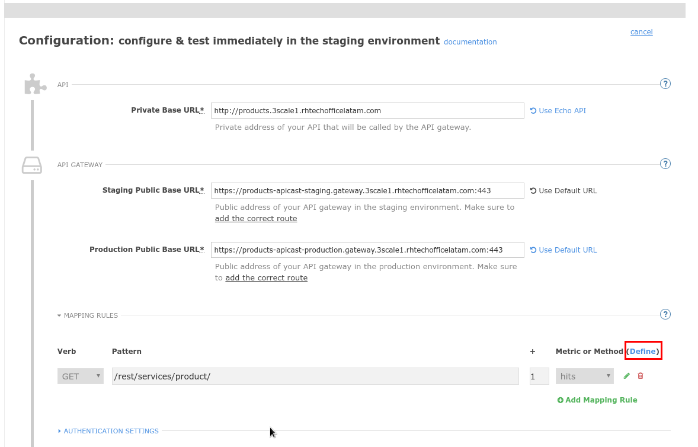

* Click on the **New Method** link in the **Methods** section.

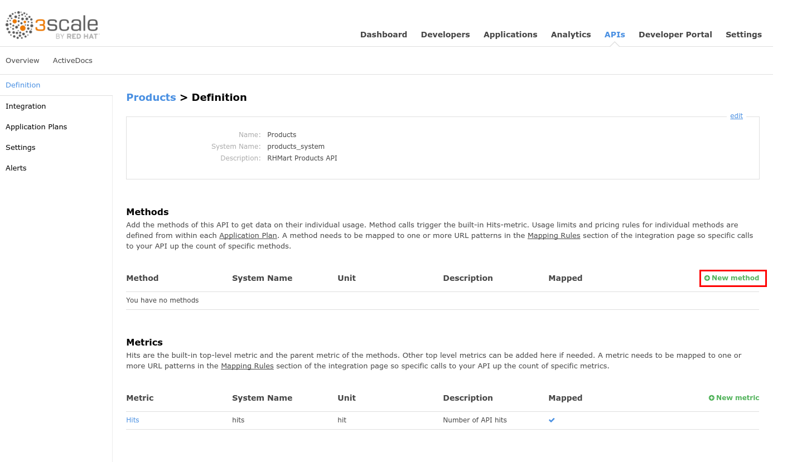

* Enter the following values:

| Parameter | Value |
| --- | --- |
| **Friendly Name** | Get Product |
| **System Name** | product/get |
| **Description** | Get a product by ID |

* Click on the **Create Method** button.

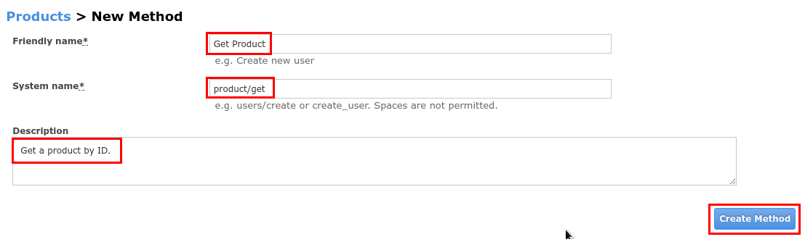

* Repeat this procedure for the following methods:

| Friendly Name | System Name | Description |
| --- | --- | --- |
| Create Product | product/create | Create a new Product |
| Delete Product | product/delete | Delete a product by ID |
| Get All Products | product/getall | Get all products |

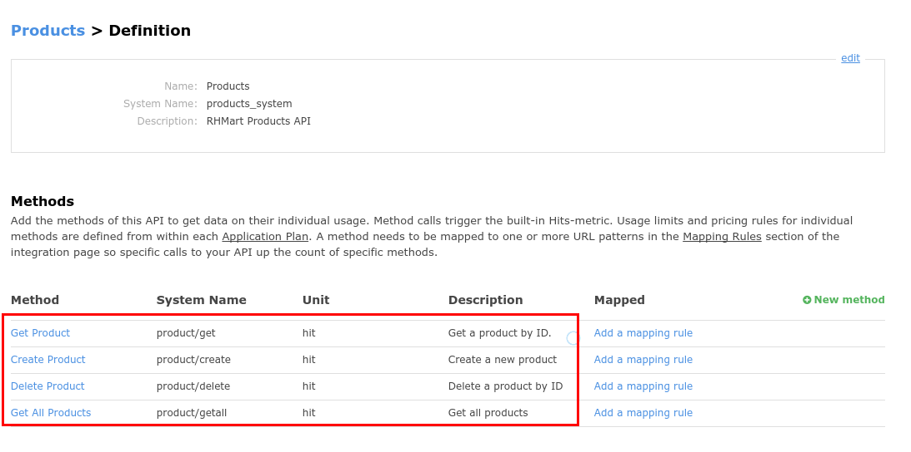

* Click on any of the “**Add a Mapping rule**” links.
* Click on the **edit** icon next to the **GET** mapping rule.
* Enter `/rest/services/product/{id}` as the **Pattern**.
* Select **product/get** as **Method**.

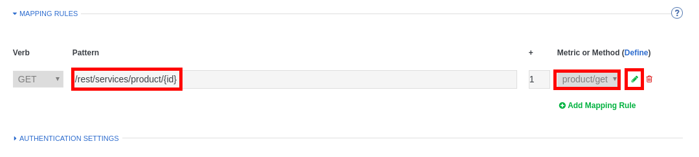

* Click on the **Add Mapping Rule** link.
* Repeat this procedure for the following values:

| Verb | Pattern | Method |
| --- | --- | --- |
| POST | /rest/services/product | product/create |
| DELETE | /rest/services/product/{id} | product/delete |
| GET | /rest/services/allproducts | product/getall |

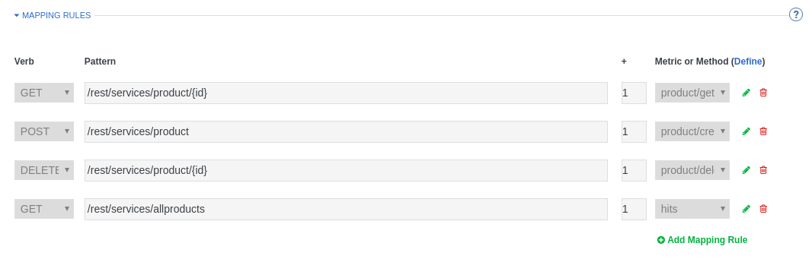

* Open a new web browser tab, and go to https://{{ book.hostname }}:8443/console/project/products-api/overview

* Take note of the Products API http route. It should be http://products.{{ book.suffix }}

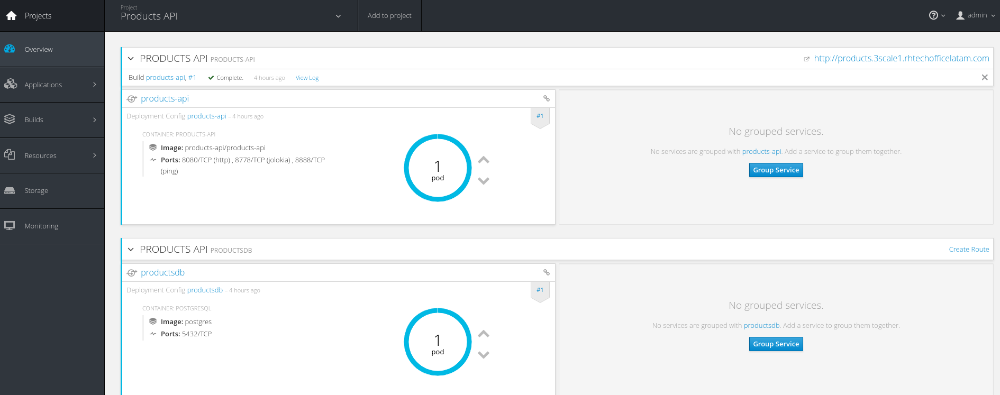


The Products API is a restful service built on Java \(JAX-RS\), deployed on JBoss EAP and connected to a PostgreSQL DB.


* Go back to 3Scale web browser tab.
* Enter the following values:

| Parameter | Value |
| --- | --- |
|**Private Base URL** | http://products.{{ book.suffix }} |
|**Staging Public Base URL** | https://products-apicast-staging.3scale.{{ book.suffix }}:443|
|**Production Public Base URL** | https://products-apicast-production.3scale.{{ book.suffix }}:443|

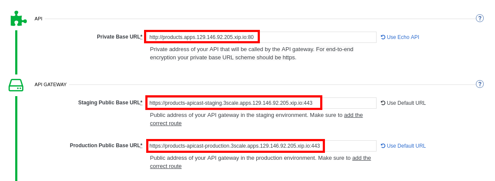

* Expand the **Policies** section.
* Click on the **Add Policy** link.

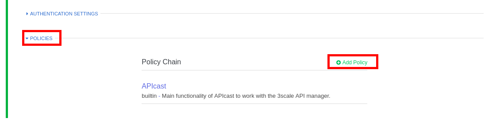

* Click on the **CORS** policy.


Cross-origin resource sharing (CORS) is a mechanism that allows restricted resources on a web page to be requested from another domain outside the domain from which the first resource was served. We will need this policy enabled later, to be able to make API calls from an OpenAPI document.


* Scroll down to **API Test GET request**.
* Enter  `/rest/services/product/1`.
* Click on the **Update & Test in Staging Environment**.
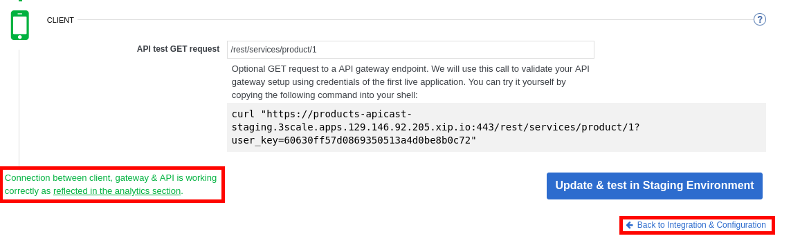

* You should get a success message.

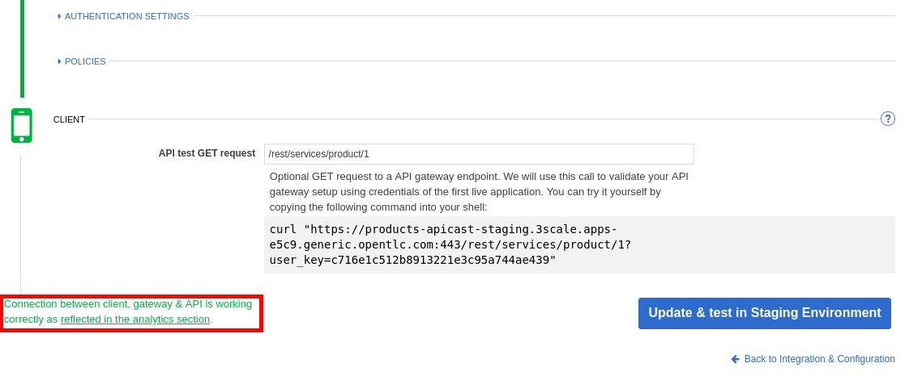

* Select the URL after “curl” and copy it.

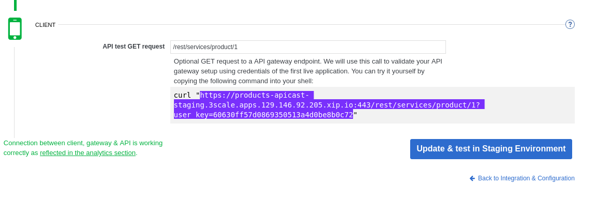

* Open a new web browser tab, and paste the URL.
* You should get a json document describing a product.

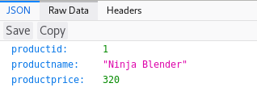

