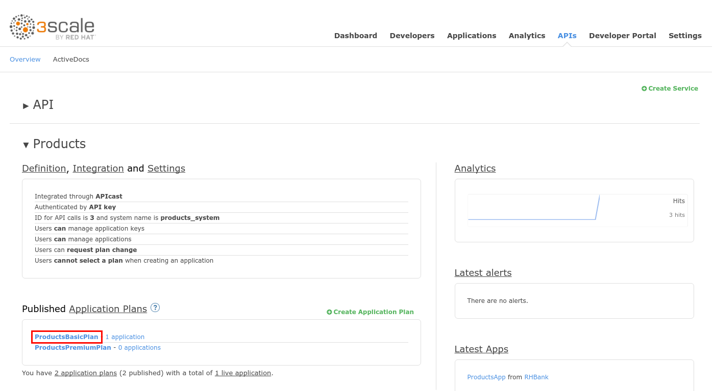
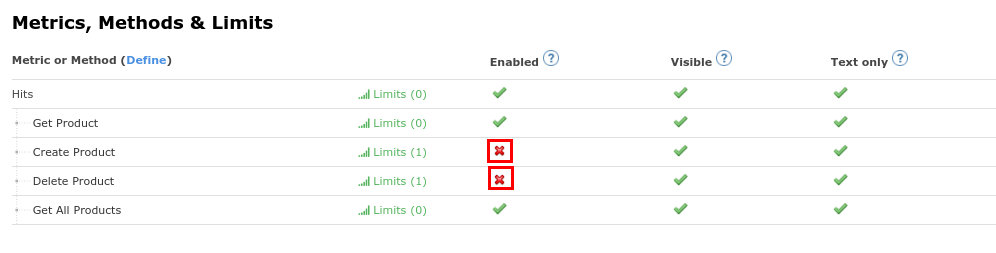
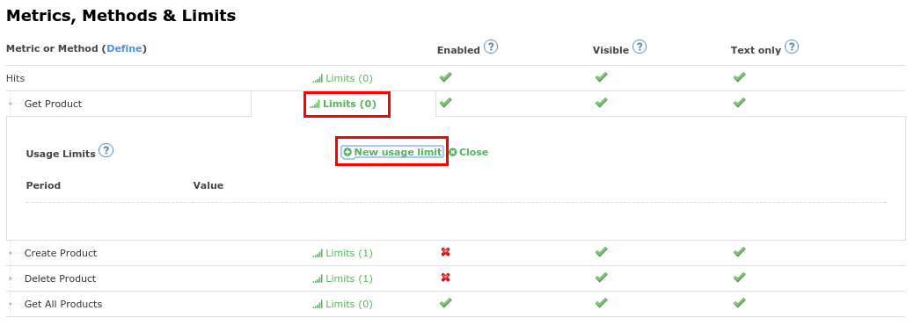
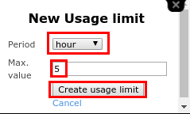
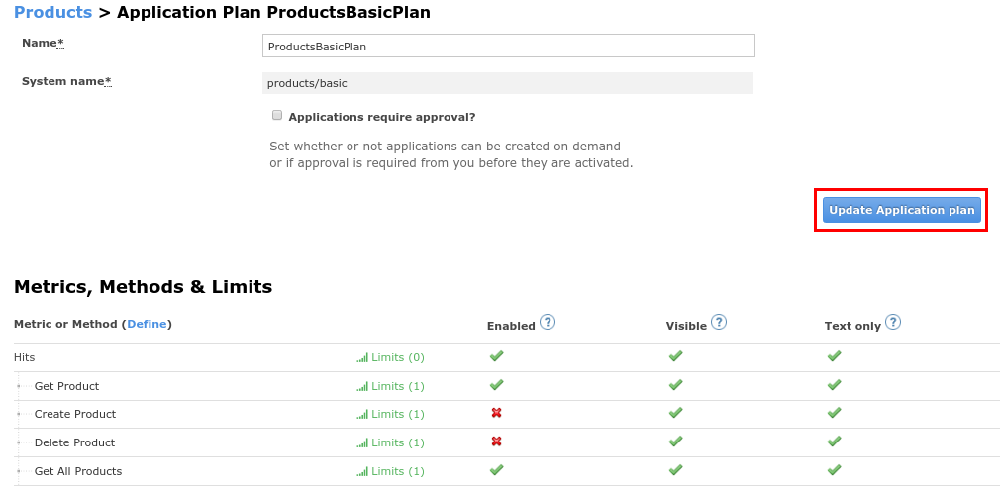
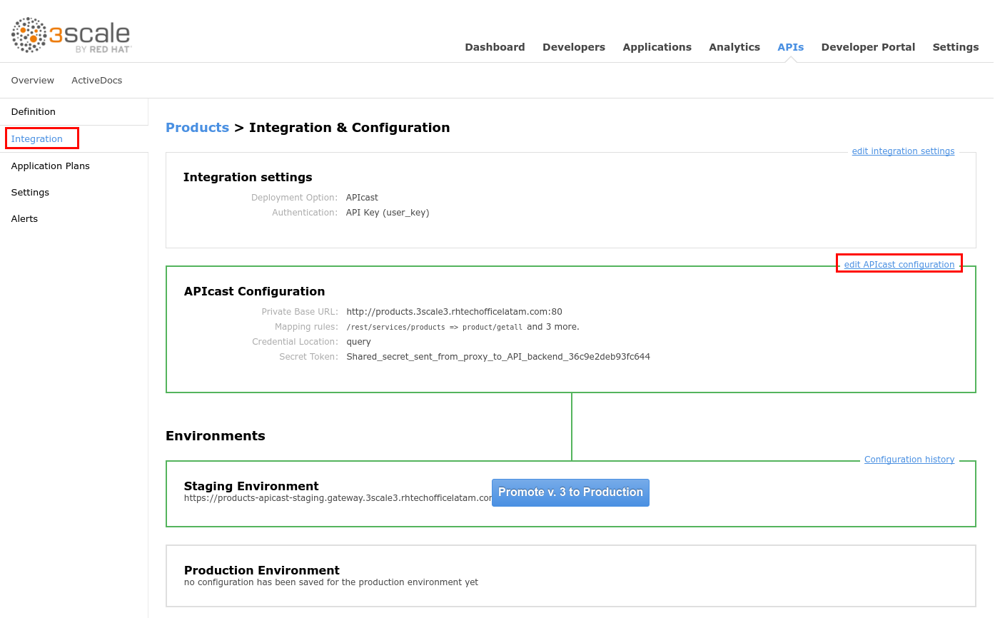
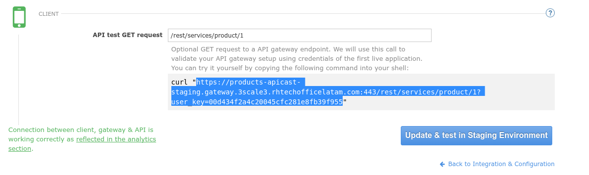

# Lab 3 - Rate Limiting {#lab-3-rate-limiting}

|  | In this lab, you configure and test a rate limiting policy in an application plan for the API created in the previous lab. |
| --- | --- |

1.  Go to [https://3scale-admin.3scale[your instance #].rhtechofficelatam.com](https://www.google.com/url?q=https://3scale-admin.3scale.rhtechofficelatam.com&sa=D&ust=1530635179325000) 
2.  Login as admin/admin
3.  Click on the APIs tab.
4.  Expand the Products API.
5.  Scroll down to the Published Application Plans section.
6.  Click on the ProductsBasicPlan.

1.  Scroll down to the Metrics, Methods &amp; Limits section.
2.  Disable both Create and Delete methods by clicking on their Enabled column.

1.  Click on the Limits link for the Get Product method.
2.  Click on the New usage limit link.

1.  Enter the following values:

1.  Period: hour
2.  Max. value: 5

1.  Click on the Create usage limit button.

1.  Click on the Limits link for the Get All Product method.
2.  Click on the New usage limit link.

1.  Enter the following values:

1.  Period: minute
2.  Max. value: 1

1.  Click on the Create usage limit button.

1.  Click on the Update Application Plan button.

|  | In the SaaS version of 3Scale AMP (and in a future release of 3Scale on-premises) you can create pricing rules for your APIs in the application plans: |
| --- | --- |

1.  Click on the Integration tab.
2.  Click on the edit APIcast configuration link.

1.  Scroll down to the bottom of the page.
2.  Select and copy the url next to “curl”.

1.  Open a new web browser tab.
2.  Paste the URL and reload it 5 times.
3.  After 6 invokations, you should receive an “Authentication failed” message since you exceeded the application plan limit (5 per hour), as defined here:

