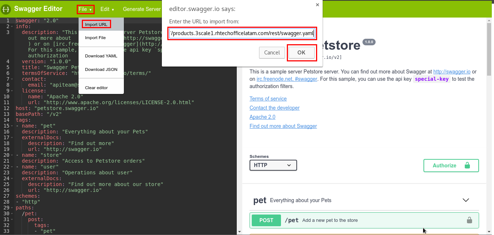
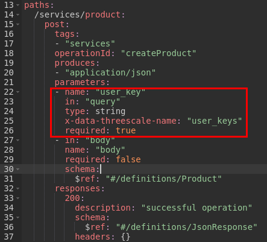
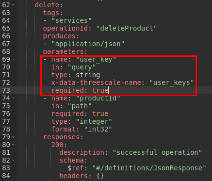
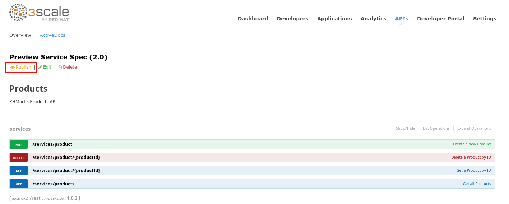

# Lab 4 - API Documentation {#lab-4-api-documentation}

|  | In this lab, you will generate and test an ActiveDocs documentation for the API created in the 2nd lab. |
| --- | --- |

1.  Open a web browser and go to [https://3scale-admin.3scale[your instance #].rhtechofficelatam.com/](https://www.google.com/url?q=https://3scale-admin.3scale1.rhtechofficelatam.com/apiconfig/services&sa=D&ust=1530635179337000)
2.  Login as admin/admin
3.  Click on the APIs tab.
4.  Click on the AciveDocs link.

1.  Click on the Create a new spec.

1.  Enter the following values:

1.  Name: Products
2.  System Name: products_spec
3.  Publish?: checked
4.  Description: Products API Documentation

1.  Open a new web browser tab, and go to [http://editor.swagger.io/](https://www.google.com/url?q=http://editor.swagger.io/&sa=D&ust=1530635179340000) 
2.  Select File -&gt; Import URL.
3.  Enter the following URL: [http://products.3scale[your instance #].rhtechofficelatam.com/rest/swagger.yaml](https://www.google.com/url?q=http://products.3scale1.rhtechofficelatam.com/rest/swagger.yaml&sa=D&ust=1530635179341000) 
4.  Click OK.

1.  In the YAML editor, make the following change:

1.  Go to line #7 and change host to: products-apicast-staging.gateway.3scale[your instance #].rhtechofficelatam.com:443

1.  For each of the available operations, you will add a query parameter (user_key) which contains the required authentication for 3Scale.
2.  Go to line #25 and add the following:

|       - name: &quot;user_key&quot; |
| --- |

1.  Go to line #50 and add the user_key query parameter.

1.  Go to line #74 and add the user_key query parameter:

1.  Go to line #99, delete the square brackets, and add the user_key query parameter.

1.  Click on File -&gt; Download JSON.
2.  Save the JSON file to your disk.
3.  Close the browser tab.
4.  Go back to the 3Scale web browser tab.
5.  Open the downloaded swagger.json file with any text editor, and copy its contents.
6.  Paste it into the API JSON Spec field.

1.  Scroll down to the bottom of the page, and click on the Create Service button.
2.  Click on the  Publish link.

1.  Expand the GET /services/products operation.
2.  Go to the Parameters section.
3.  Click on the user_key value field.
4.  Select the ProductsApp user_key.

1.  Click on the Try it Out! Button.
2.  You should get a successful response like the following:

1.  If you get a “No Content” error, copy the displayed URL, open a new tab and paste the URL.
2.  Accept the certificate.
3.  Close the tab and test the API again.