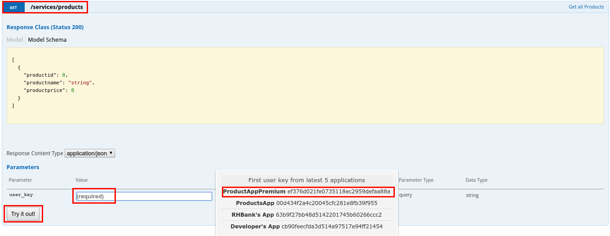
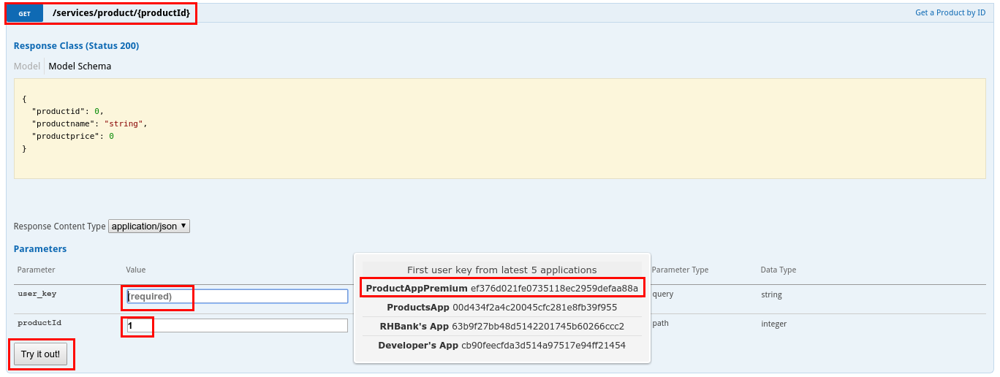
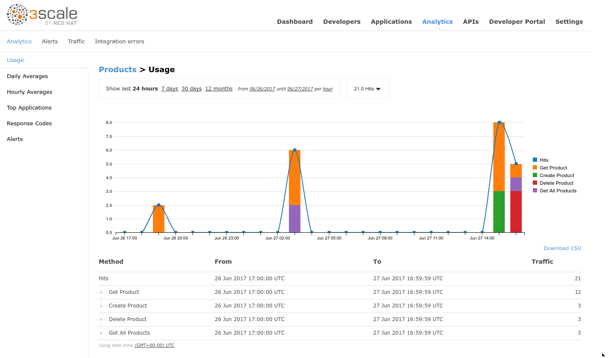

# Lab 5 - Analytics {#lab-5-analytics}


In this lab you will generate some load for the API and then check out the analytics graphics to understand API’s traffic.


* Open a web browser and go to https://3scale-admin.3scale.{{ book.suffix }}
* Login as admin/admin.
* Click on the **Applications** tab.
* Click on the **ProductsApp** application.
* Copy the **User Key** under **API Credentials**.

* Click on the **APIs** tab.
* Click on the **ActiveDocs** tab.

* Click on the **Products** spec.

* Expand the **POST** method.
* If already not logged in:
    * Click on the red circle icon with the exclamation mark.
    * Paste the api_key in the **value** field.
    * Click on the **Authorize** button.

*  Click on the Model next to the body field.

* Remove the **productid** field from the sample json document.
* Click on the **Try it out!** button.

*  You should get an authorization error, since the application you are using (**RHBank’s App**) is subscribed to the **ProductsBasicPlan** which only allows the GET methods.

* Collapse the **POST** method by clicking on it.
* Click on the **Developers** tab.
* Click on the **RHBank** account.

* Click on the **2 Applications **breadcrumb.
* Click on the **Create Application** link.

* Select the **ProductsPremiumPlan**.
* Enter the following values:

| Parameter | Value |
| --- | --- |
| **Name** | ProductsAppPremium |
| **Description** | RHBank Products Premium App |

*  Click on the **Create Application** button.

* Click on the **APIs** tab.
* Click on the **ActiveDocs** tab.
* Click on the **Products** spec.

* Expand the **POST** method.
* Click on the **user_key** field, and select **ProductsAppPremium** user key.

1.  Click on the Model next to the body field.

1.  Remove the productid field from the sample json document.
2.  Replace “string” with “LED TV”.
3.  Replace “0” with “199.99”.
4.  Click on the Try it out! button.

1.  You should receive a successful response.

1.  Repeat these steps two times, to create two more products:

| productname | productprice |
| --- | --- |
| LED Smart TV | 299.99 |
| LED Smart TV 3D | 399.99 |

1.  Collapse the POST method by clicking on it.
2.  Expand the GET /services/products operation.
3.  Click on the user_key field and select ProductsAppPremium.
4.  Click on the Try it out! button.

1.  You should receive a list of all existing products.
2.  Validate the products you created in the previous step are present.
3.  Click several times on the Try it out! button to generate some traffic.
4.  Collapse this operation by clicking on it.
5.  Expand the GET /services/product/{productId} operation.
6.  Click on the user_key field and select ProductsAppPremium.
7.  Enter a product id in the productid field (from the list of products retrieved in the previous step)
8.  Click on the Try it out! button.

1.  Click several times on the Try it out! button to generate some traffic.
2.  Collapse the operation by clicking on it.
3.  Expand the DELETE operation.
4.  Click on the user_key field and select RHBank Premium App.
5.  Enter a product id in the productid field (from the products created in the previous steps, should be 11, 12 and 13).
6.  Click on the Try it out! button.

1.  Execute this operation two times, changing the product id.
2.  Click on the Analytics tab.
3.  Click on the Products API.

1.  You should see a graphic similar to this one:

1.  Hover over the bars to see detailed information per period.

1.  Hover over the operation names to the right of the chart.

1.  Click on the different period options (7days, 30 days, 12 months).
2.  Click on the Daily Averages tab.
3.  Select an operation from the dropdown.

1.  Click on the Hourly Averages tab.

1.  Click on the Traffic tab.

1.  Click on the Applications tab.
2.  Click on the second ProductsApp.

1.  Scroll down to the Current Utilization section.

1.  Here you can monitor an application’s limits.
2.  Click on the Applications tab.
3.  Click on the ProductsAppApremium.

1.  Click on the Analytics breadcrumb.
2.  Here you can monitor a specific application’s usage:

