# Lab 5 - Analytics {#lab-5-analytics}


In this lab you will generate some load for the API and then check out the analytics graphics to understand API’s traffic.


* Open a web browser and go to https://3scale-admin.3scale.{{ book.suffix }}
* Login as admin/admin.
* Click on the **Applications** tab.
* Click on the **ProductsApp** application.
* Copy the **User Key** under **API Credentials**.

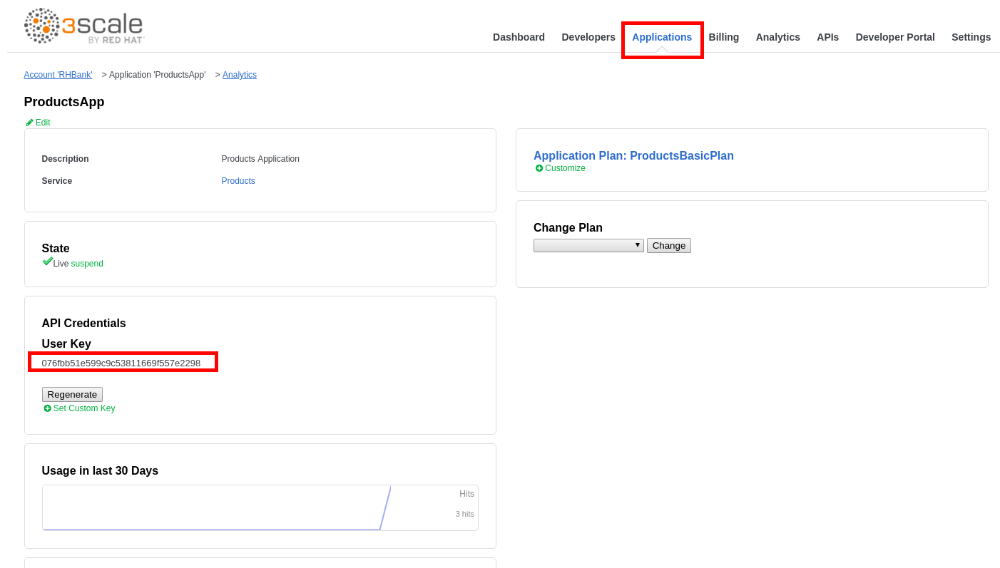

* Click on the **APIs** tab.
* Click on the **ActiveDocs** tab.

* Click on the **Products** spec.

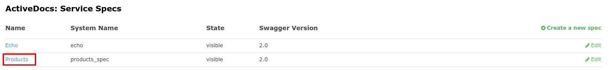

* Expand the **POST** method.
* If already not logged in:
    * Click on the red circle icon with the exclamation mark.
    * Paste the api_key in the **value** field.
    * Click on the **Authorize** button.

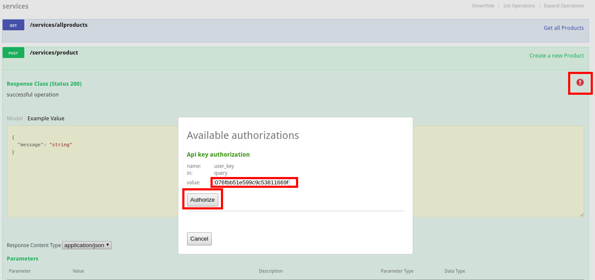
*  Click on the Model next to the body field.

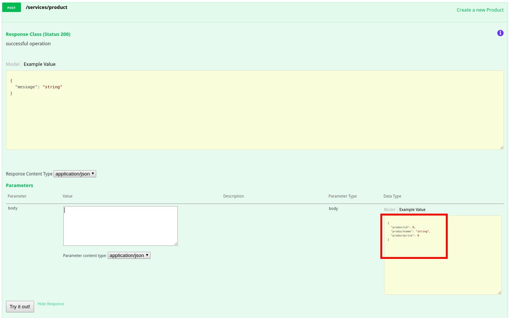

* Remove the **productid** field from the sample json document.
* Click on the **Try it out!** button.

*  You should get an authorization error, since the application you are using (**RHBank’s App**) is subscribed to the **ProductsBasicPlan** which only allows the GET methods.

* Collapse the **POST** method by clicking on it.
* Click on the **Developers** tab.
* Click on the **RHBank** account.

* Click on the **2 Applications **breadcrumb.
* Click on the **Create Application** link.

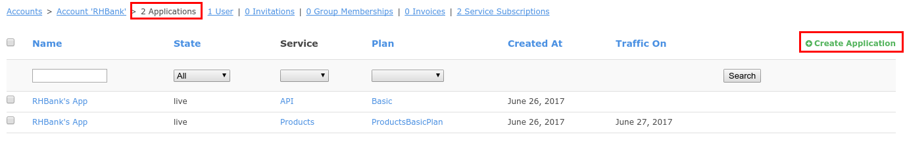

* Select the **ProductsPremiumPlan**.
* Enter the following values:

| Parameter | Value |
| --- | --- |
| **Name** | ProductsAppPremium |
| **Description** | RHBank Products Premium App |

*  Click on the **Create Application** button.

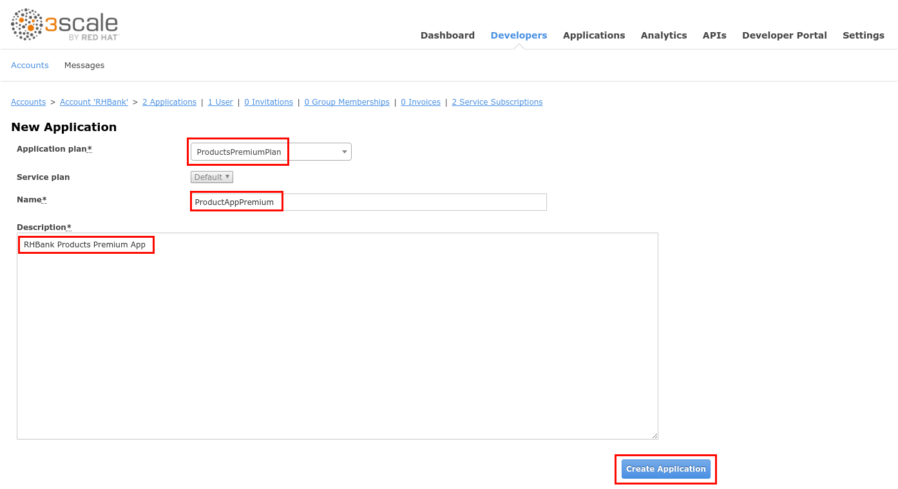

* Copy the **User Key** under **API Credentials**.

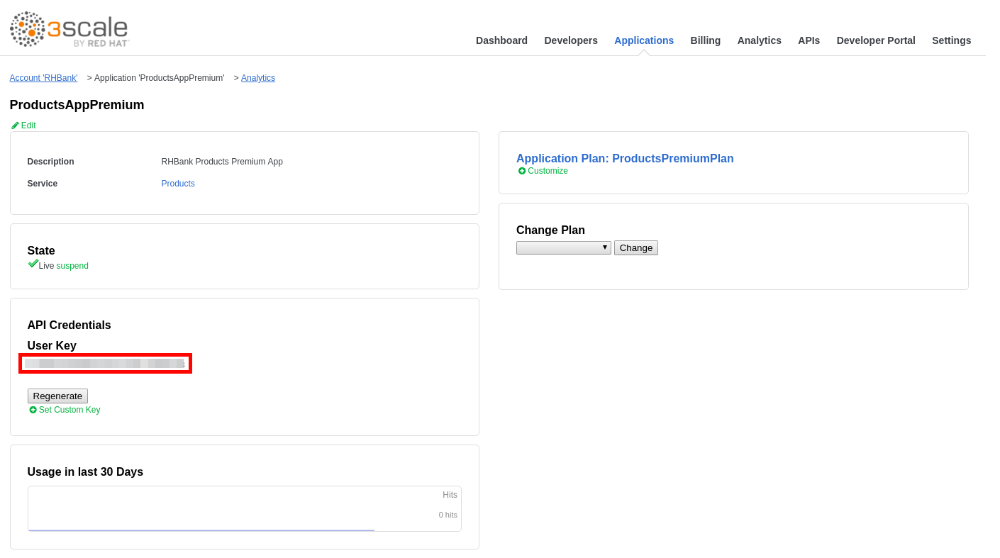

* Click on the **APIs** tab.
* Click on the **ActiveDocs** tab.
* Click on the **Products** spec.

* Expand the **POST** method.
* Click on the red circle icon with the exclamation mark.
* Paste the api_key in the **value** field.
* Click on the **Authorize** button.

* Click on the Model next to the body field.

* Remove the productid field from the sample json document.
* Replace “string” with “LED TV”.
* Replace “0” with “199.99”.
* Click on the **Try it out!** button.

* You should receive a successful response.

* Repeat these steps two times, to create two more products:

| productname | productprice |
| --- | --- |
| LED Smart TV | 299.99 |
| LED Smart TV 3D | 399.99 |

* Collapse the **POST** method by clicking on it.
* Expand the **GET /services/allproducts** operation.
* Click on the **Try it out!** button.

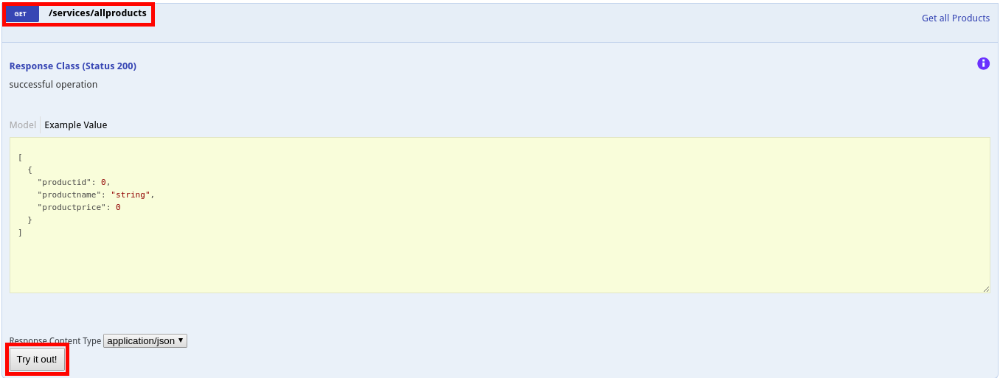

* You should receive a list of all existing products.
* Validate the products you created in the previous step are present.
* Click the **Try it out!** button several times, to generate some traffic.
* Collapse this operation by clicking on it.
* Expand the **GET /services/product/{productId}** operation.
* Enter a product id in the **productId** field (from the list of products retrieved in the previous step)
* Click on the **Try it out!** button.

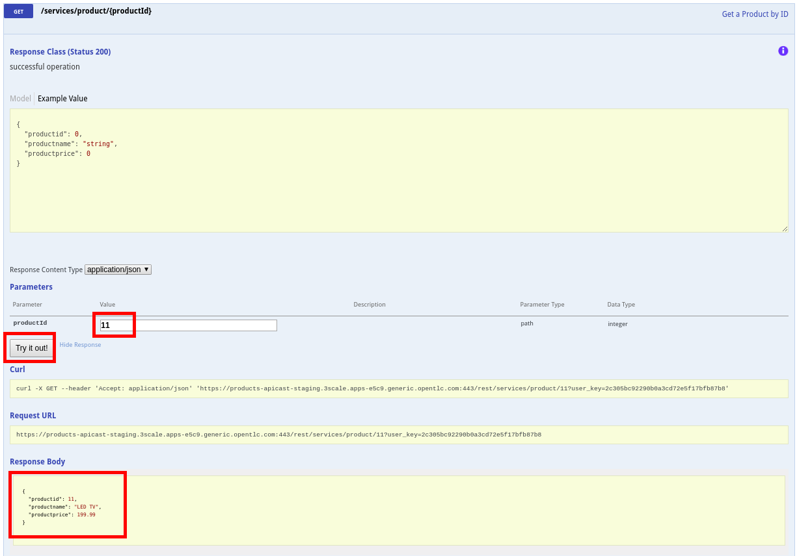

* Click the **Try it out!** button several times to generate some traffic.
* Collapse the operation by clicking on it.
* Expand the **DELETE** operation.
* Enter a product id in the **productId** field (from the products created in the previous steps, should be 11, 12 and 13).
6.  Click on the **Try it out! **button.

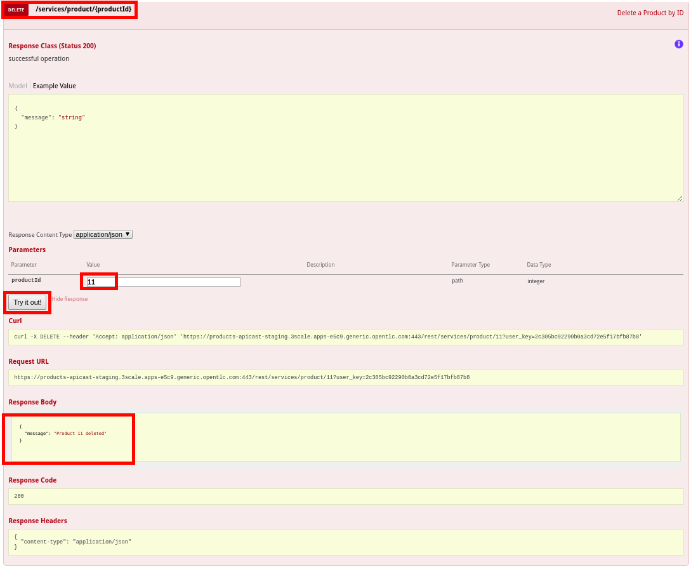

* Execute this operation two times, changing the product id.
* Click on the **Analytics** tab.
* Click on the **Products** API.

* You should see a graphic similar to this one:

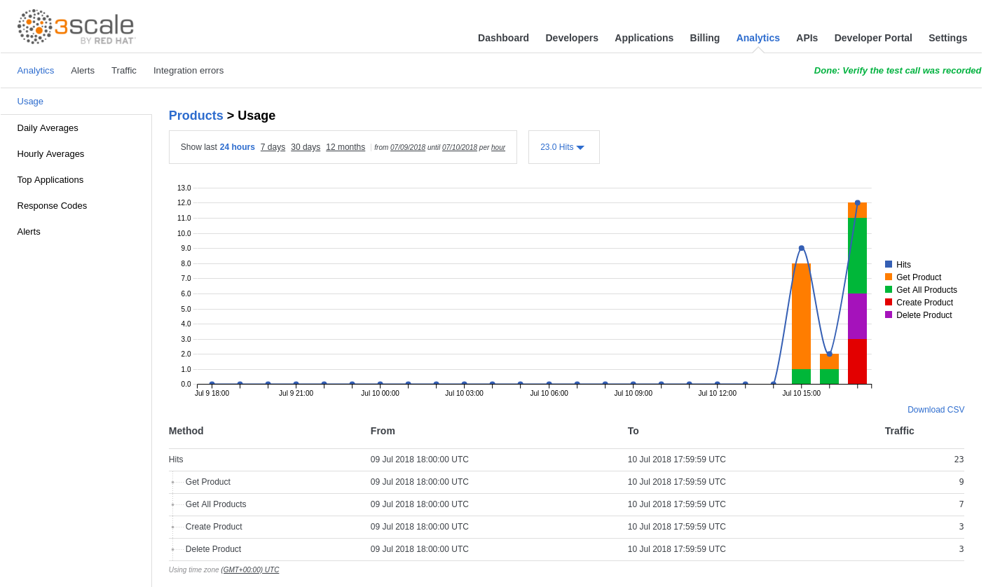

* Hover over the bars to see detailed information per period.

* Hover over the operation names to the right of the chart.

* Click on the different period options (7 days, 30 days, 12 months).
* Click on the **Daily Averages** tab.
* Select an operation from the dropdown.

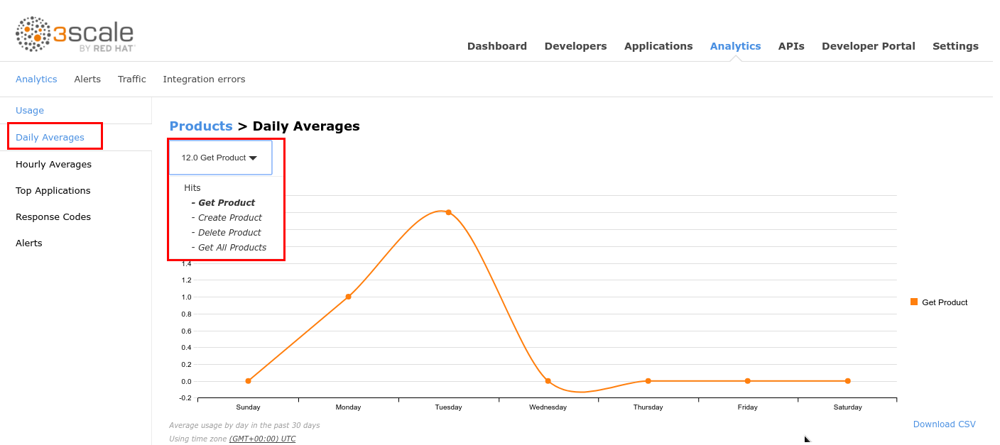

* Click on the **Hourly Averages** tab.

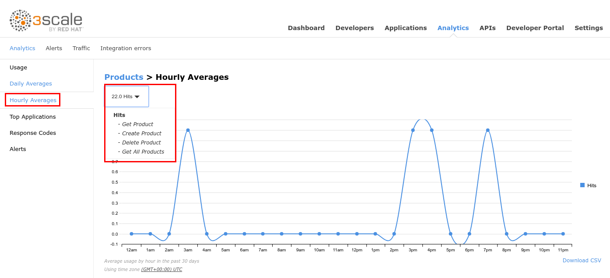

* Click on the **Traffic** tab.

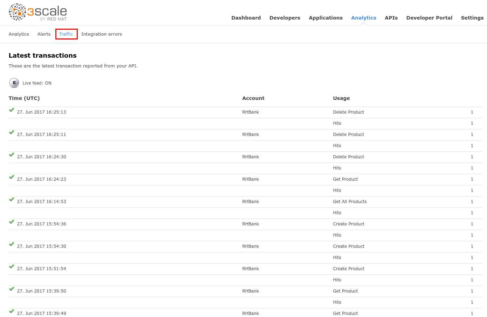

* Click on the **Applications** tab.
* Click on the **ProductsApp** application.

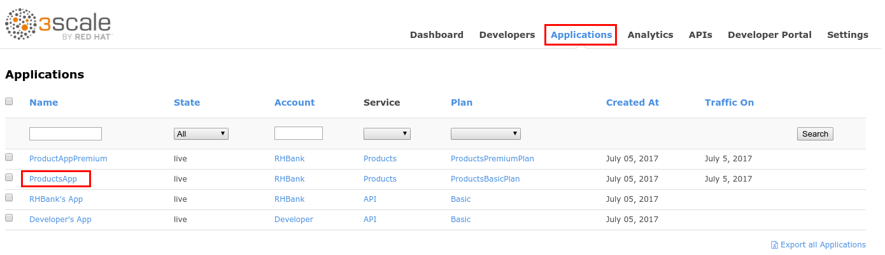

* Scroll down to the **Current Utilization** section.


Here you can monitor an application’s limits.


* Click on the **Applications** tab.
* Click on the **ProductsAppApremium** application.

* Click on the **Analytics** breadcrumb.
* Here you can monitor a specific application’s usage:

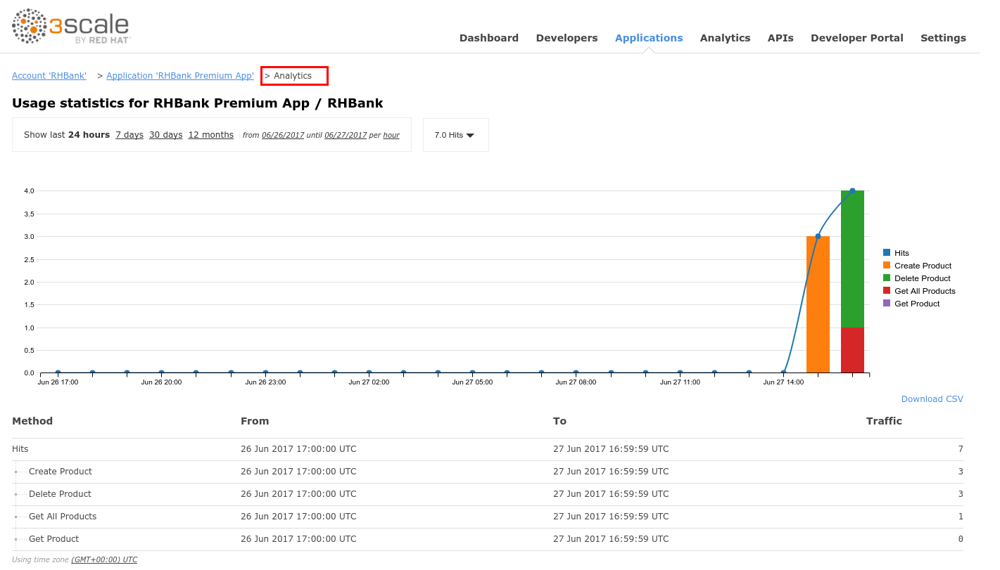