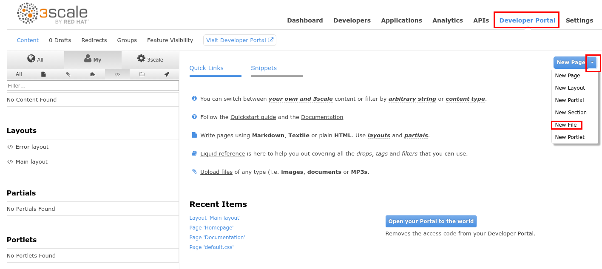
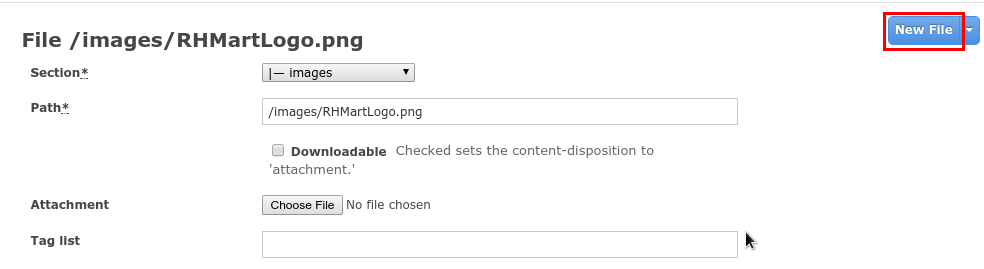
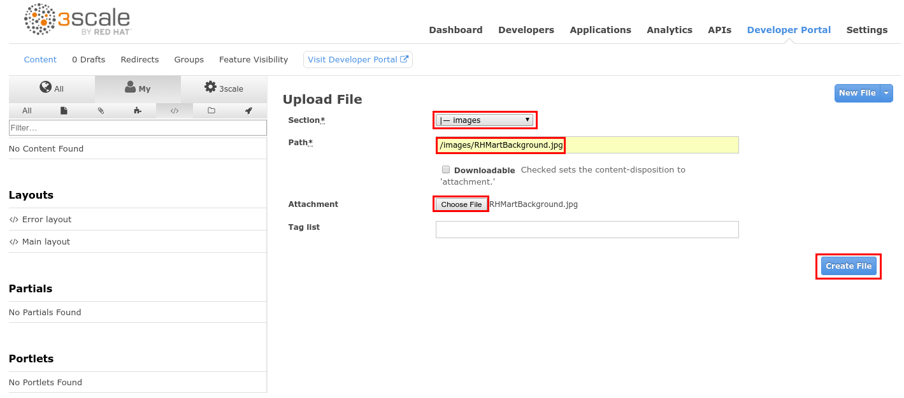
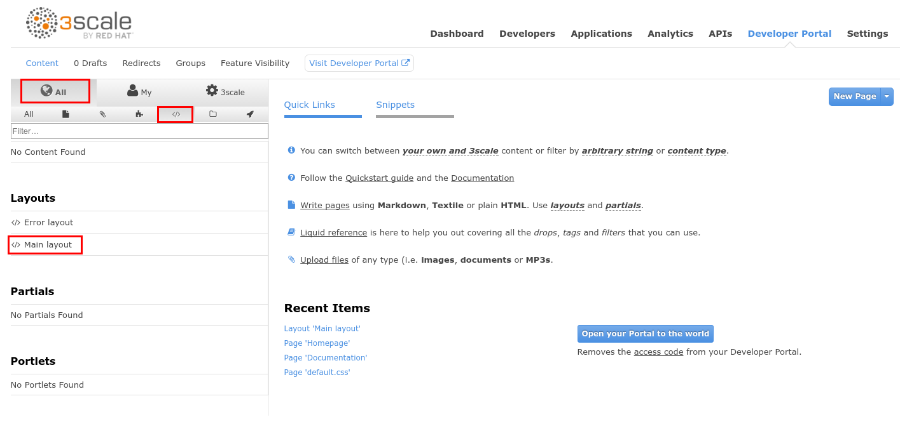
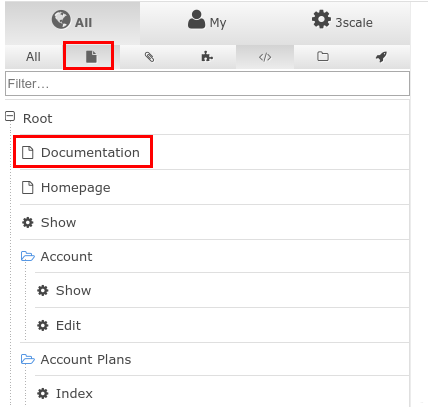
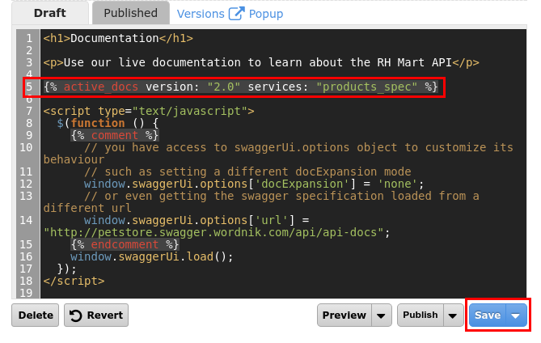
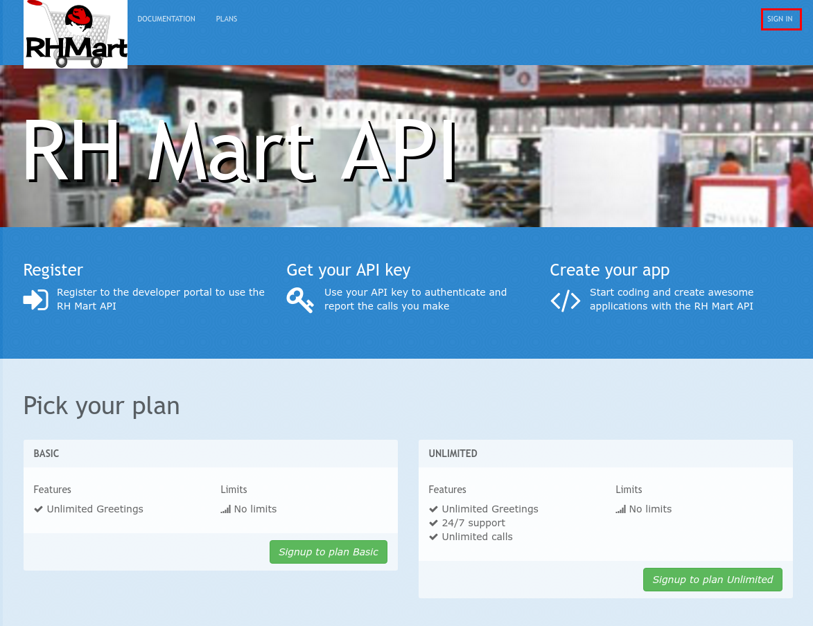
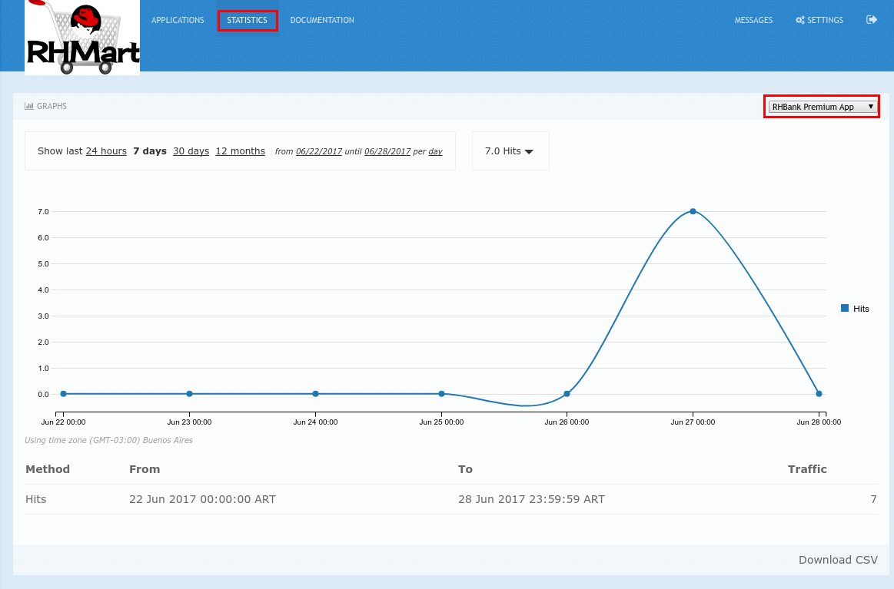
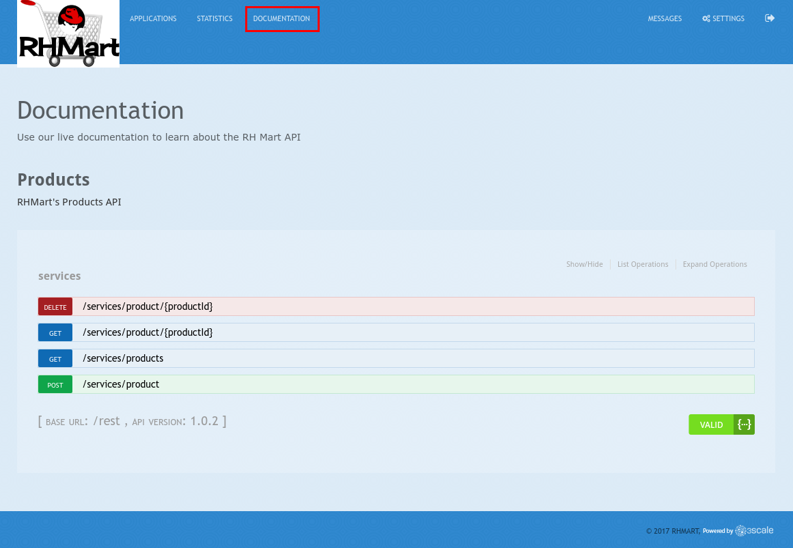

# Lab 6 - Developer Portal {#lab-6-developer-portal}

|  | In this lab you will work on the Developer Portal for the API’s customers/partners/users. |
| --- | --- |

1.  Open a web browser.
2.  Download this two files:

1.  [https://github.com/pszuster/3ScaleTD/raw/master/DevPortal/RHMartLogo.png](https://www.google.com/url?q=https://github.com/pszuster/3ScaleTD/raw/master/DevPortal/RHMartLogo.png&sa=D&ust=1530635179364000)
2.  [https://github.com/pszuster/3ScaleTD/raw/master/DevPortal/RHMartBackground.jpg](https://www.google.com/url?q=https://github.com/pszuster/3ScaleTD/raw/master/DevPortal/RHMartBackground.jpg&sa=D&ust=1530635179365000) 

1.  Go to https://3scale-admin.3scale[your instance #].rhtechofficelatam.com
2.  Login as admin/admin
3.  Click on the Developer Portal tab.
4.  Click on the arrow next to New Page button.
5.  Click on New File.

1.  Set Section to images.
2.  Set Path to /images/RHMartLogo.png
3.  Click on the Choose File button.
4.  Select the RHMartLogo.png file you downloaded in the first step.
5.  Click on the Create File button.

1.  Click on the New File button.

1.  Set Section to images.
2.  Set Path to /images/RHMartBackground.jpg
3.  Click on the Choose File button.
4.  Select the RHMartBackground.jpg file you downloaded in the first step.
5.  Click on the Create File button.

1.  Click on the All button.
2.  Click on the Layouts icon.
3.  Click on Main Layout.

1.  Go to line #46.
2.  Replace it with the following:

| &lt;div class=&quot;logo&quot;&gt; |
| --- |

1.  Scroll down to the bottom of the page, and click on the Save button.

1.  Click on the Pages icon.
2.  Click on Documentation.

1.  Go to line #3 and replace “Echo” with “RHMart”.
2.  Go to line #5.
3.  Replace the line with the following:

| {active_docs version: &quot;2.0&quot; services: &quot;products_spec&quot; %} |
| --- |

1.  Click on the Save  button.

1.  Click on Homepage.

1.  Go to the HTML editor, and perform a search and replace of “Echo” (with capital “E”) to “RHMart” in lines #19, #98 and #112.
2.  Go to line #5.
3.  Replace it with the following:

| &lt;h1 style=&quot;text-shadow: 4px 4px #000000;&quot;&gt;RH Mart API&lt;/h1&gt; |
| --- |

1.  Scroll down to the bottom of the page and click on the Save button.
2.  Click on default.css, under the css folder.

1.  Go to line #22.
2.  Replace it with the following:

|   background-image: url(&#039;/images/RHMartBackground.jpg&#039;); |
| --- |

1.  Scroll down to the bottom of the page.
2.  Click on the Save button.
3.  Click on the 0 Drafts tab.
4.  Click on Publish All.
5.  Accept the warning.

1.  Click on the Visit Developer Portal button.

1.  Click on SIGN IN.

1.  Login as

1.  Username: rhbankdev
2.  Password: rhbank

1.  Click on Applications.
2.  Review available applications for the RHBank account.
3.  Click on Statistics.
4.  Take a look at the traffic by application.

1.  Click on Documentation.
2.  Expand an operation and test it.

