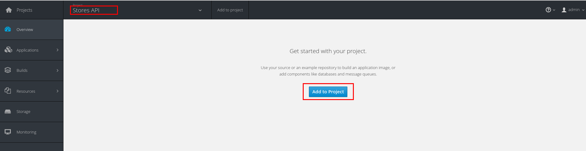
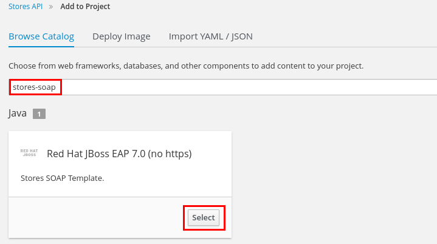
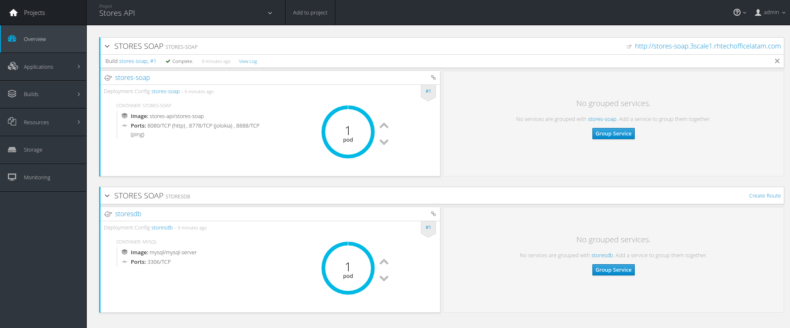
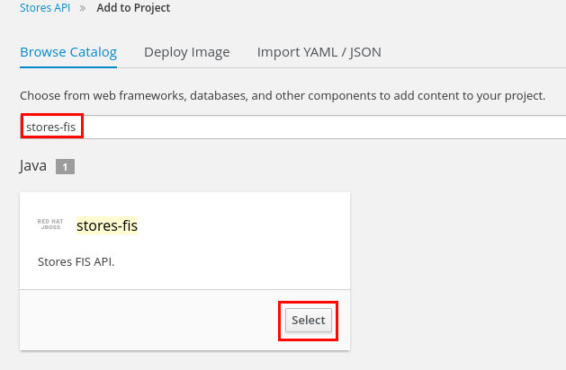

# Lab 7 - Exposing a SOAP Service with FIS {#lab-7-exposing-a-soap-service-with-fis}

|  | In this lab you will expose an existing SOAP based JEE application running on a JBoss EAP container in the same OCP cluster. To do this, you will deploy a Fuse Integration Services (FIS) application to OCP, which was configured to expose it as a REST service. |
| --- | --- |

1.  Open a web browser and go to [https://github.com/pszuster/3ScaleTD/blob/master/Stores/src/main/java/com/redhat/service/StoresWS.java](https://www.google.com/url?q=https://github.com/pszuster/3ScaleTD/blob/master/Stores/src/main/java/com/redhat/service/StoresWS.java&sa=D&ust=1530635179385000)
2.  This simple java class implements a JAX-WS SOAP webservice that allows consumers to create, delete or get Stores from RHMart.

1.  Go to https://threescale.3scale[your instance #].rhtechofficelatam.com:8443
2.  Login as admin/admin
3.  Select the Stores API project.
4.  Click on the Add to Project button.

1.  Enter “stores-soap” in the Browse Catalog search field.
2.  Click on the Select button in the found template.

1.  Modify the “Custom http Route Hostname” to: stores-soap.3scale[tour instance #].rhtechofficelatam.com
2.  Scroll down to the bottom of the page and click on the Create button.
3.  Click on the Continue to Overview link.
4.  After ~5min the Stores SOAP API should be up and running (there should be two blue circles).

1.  Open a new web browser tab, and go to [http://wsdlbrowser.com/](https://www.google.com/url?q=http://wsdlbrowser.com/&sa=D&ust=1530635179387000)
2.  Enter the following value:

*   WSDL URL:  http://stores-soap.3scale[your instance #].rhtechofficelatam.com/StoresWS?wsdl

1.  Click on the Browse button.

1.  Click on the getAllStores Soap operation.
2.  Click on the Call Function button.

1.  Close the browser tab, and go back to OpenShift console.
2.  Make sure you are in the Stores API project.
3.  Click on the  Add to project button.

1.  Enter “stores-fis” in the Browse Catalog search field.
2.  Click on the Select button in the found template.

1.  Change the HostName parameter to: stores-fis.3scale[your instance #].rhtechofficelatam.com

1.  Scroll down to the bottom of the page, and click on the Create button.
2.  Click on the Continue to overview link.
3.  After ~3min the Fuse Integration Services container should be up and running (there should be a blue circle).

|  | This Fuse Integration Services container, has a SpringBoot Camel route, that transforms REST requests to SOAP requests and XML SOAP responses to JSON documents. |
| --- | --- |

1.  Open a new web browser tab, and go to http://stores-fis.3scale[your instance #].rhtechofficelatam.com/allstores/
2.  You should receive a JSON document generated from the SOAP response.
3.  Close the tab.
4.  Go to https://3scale-admin.3scale[your instance #].rhtechofficelatam.com.
5.  Click on the configuration icon.
6.  Click on Personal Settings.

1.  Click on the Tokens tab.
2.  Click on the Add Access Token link.

1.  Enter Name: importer
2.  Check on both

*   Account Management API
*   Analytics API

1.  Select Permission: Read &amp; Write.
2.  Click on the Create Access Token button.

1.  Select and copy the generated Token.

1.  Open a new web browser tab and go to http://swagger-import.3scale[your instance #].rhtechofficelatam.com/
2.  Enter the following values:

*   Access Token: paste the copied Token.
*   3Scale ID: 3scale
*   Wildcard Domain: 3scale[your instance #].rhtechofficelatam.com
*   Swagger File URL: http://stores-fis.3scale[your instance #].rhtechofficelatam.com/api-docs

1.  Click on the Import API button.

1.  After a couple of seconds, the import should be done.

1.  Close the browser tab.
2.  Go back to  https://3scale-admin.3scale[your instance #].rhtechofficelatam.com.
3.  Click on the APIs tab.
4.  Expand Stores API.
5.  Click on the Create Application Plan link

1.  Enter the following values:

*   Name: StoresPremiumPlan
*   System Name: storesPremiumPlan

1.  Click on the Create Application Plan button.

1.  Click on the Publish link.

1.  Click on the Developers tab.
2.  Click on the RHBank account.

1.  Click on the 3 Applications. Breadcrumb.
2.  Click on the Create Application link.

1.  Select the StoresPremiumPlan.
2.  Enter the following values:

*   Name: storesApp
*   Description: Stores Application

1.  Click on the Create Application button.

1.  Click on the Stores API link.

1.  Click on the Integration tab.
2.  Click on the  add the base URL of your API and save the configuration button.

1.  Enter the following values:

*   Private Base URL: [http://stores-fis.3scale[your instance #].rhtechofficelatam.com](https://www.google.com/url?q=http://stores-fis.3scale1.rhtechofficelatam.com&sa=D&ust=1530635179401000)
*   Staging Public Base URL: [https://stores-apicast-staging.gateway.3scale[your instance #].rhtechofficelatam.com:443](https://www.google.com/url?q=https://stores-apicast-staging.gateway.3scale1.rhtechofficelatam.com:443&sa=D&ust=1530635179402000)
*   Production Public Base URL: [https://stores-apicast-production.gateway.3scale](https://www.google.com/url?q=https://stores-apicast-production.gateway.3scale1.rhtechofficelatam.com:443&sa=D&ust=1530635179403000)[[your instance #]](https://www.google.com/url?q=https://stores-apicast-staging.gateway.3scale1.rhtechofficelatam.com:443&sa=D&ust=1530635179403000)[.rhtechofficelatam.com:443](https://www.google.com/url?q=https://stores-apicast-production.gateway.3scale1.rhtechofficelatam.com:443&sa=D&ust=1530635179403000) 
*   API test GET request: /allstores

1.  Click on the  Update &amp; test in Staging Environment button.

1.  You should receive a successful validation.
2.  Click on the Back to Integration &amp; Configuration link.

1.  Click on the Promote v1 to Production button.

1.  Click on the ActiveDocs tab.
2.  Click on the Edit icon for the Stores API spec.

1.  Change the host attribute to: stores-apicast-production.gateway.3scale[your instance #].rhtechofficelatam.com
2.  For each of the four user_key parameters, add the following attribute: ,&quot;x-data-threescale-name&quot;: &quot;user_keys&quot;

1.  Scroll down to the bottom of the page and click on the Update Service button.
2.  Open a web browser tab and go to [https://stores-apicast-production.gateway.3scale[your instance #].rhtechofficelatam.com](https://www.google.com/url?q=https://stores-apicast-production.gateway.3scale1.rhtechofficelatam.com&sa=D&ust=1530635179407000) and accept the SSL certificate.
3.  Close the tab and go back to the Stores API ActiveDoc.
4.  Expand the /allstores operation.
5.  Click on the user_key parameter field and select the storesApp user key.
6.  Click on the Try it out! button.

1.  You should receive a JSON document with a list of stores.

