# Lab 7 - Exposing a SOAP Service with FIS {#lab-7-exposing-a-soap-service-with-fis}


In this lab you will expose an existing SOAP based JEE application running on a JBoss EAP container in the same OCP cluster. To do this, you will deploy a Fuse on Openshift application (formerly known as Fuse Integration Services) to your Openshift cluster, which was built to expose the SOAP webservice as a REST API. 


* Open a web browser and go to [https://github.com/pszuster/3ScaleTD/blob/master/Stores/src/main/java/com/redhat/service/StoresWS.java](https://github.com/pszuster/3ScaleTD/blob/master/Stores/src/main/java/com/redhat/service/StoresWS.java)


This simple java class implements a JAX-WS SOAP webservice that allows consumers to create, delete or get Stores from RHMart. 


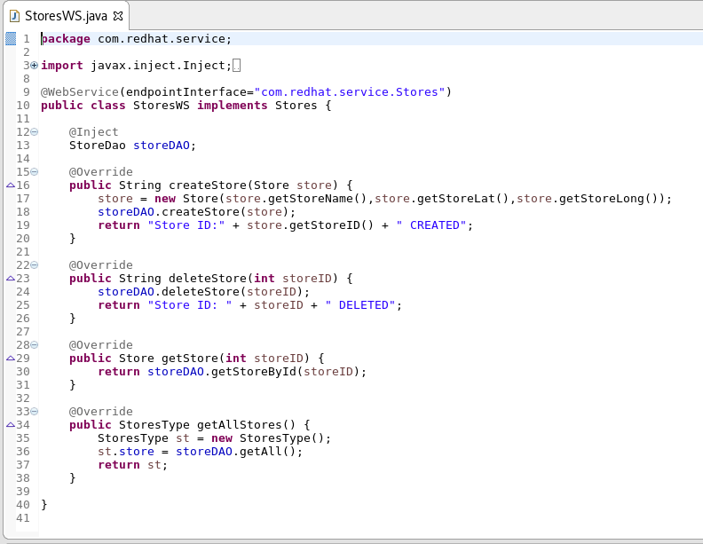


* Go to https://3scale-admin.3scale.{{ book.suffix }}
* Click on the **configuration** icon.
* Click on **Personal Settings**.


* Click on the **Tokens** tab.
* Click on the **Add Access Token** link.


* Enter **Name**: importer
* Check on the three scopes.
* Select Permission: **Read &amp; Write**
* Click on the **Create Access Token **button.

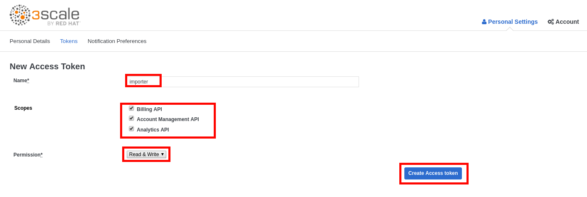

* Select and copy the generated Token.

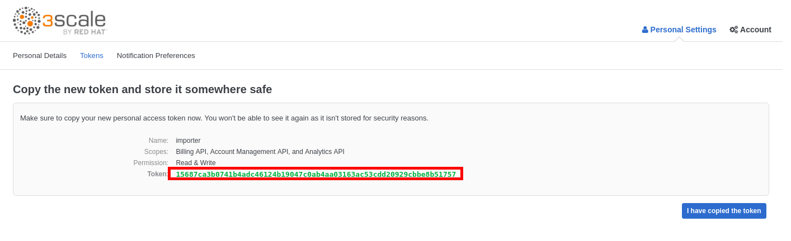

* Open a new web browser tab and go to http://swagger-import.{{ book.suffix }}
* Enter the following values:

| Parameter | Value |
| --- | --- |
| **Access Token** | &lt;paste the copied Token&gt; |
| **3Scale ID** | 3scale |
| **Wildcard Domain** | 3scale.{{ book.suffix }} |
| **Swagger File URL** | http://stores-fis.{{ book.suffix }}/api-docs|

* Click on the **Import API** button.

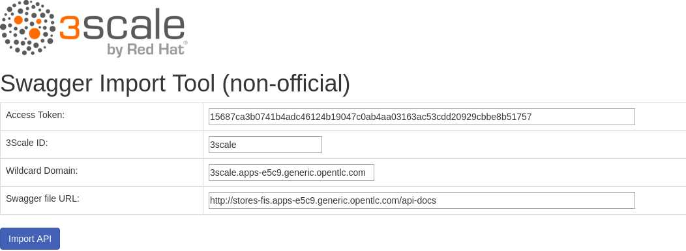

* After a couple of seconds, the import process should be done.

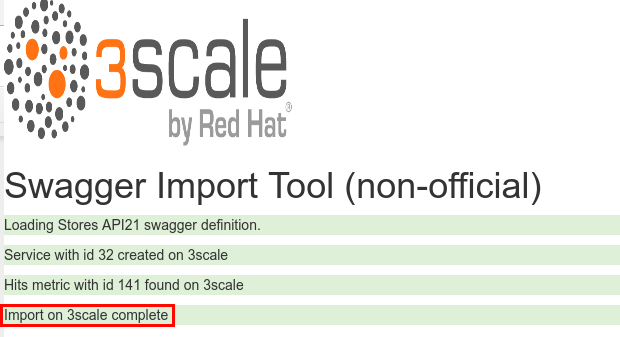

* Close the browser tab.
* Go back to  https://3scale-admin.{{ book.suffix }}
* Click on the **APIs** tab.
* Expand **Stores API**.
* Click on the **Create Application Plan** link

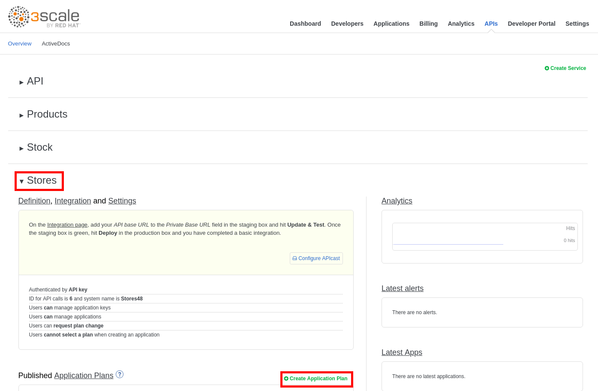

* Enter the following values:
    * **Name**: StoresPremiumPlan
    * **System Name**: storesPremiumPlan

* Click on the **Create Application Plan** button.

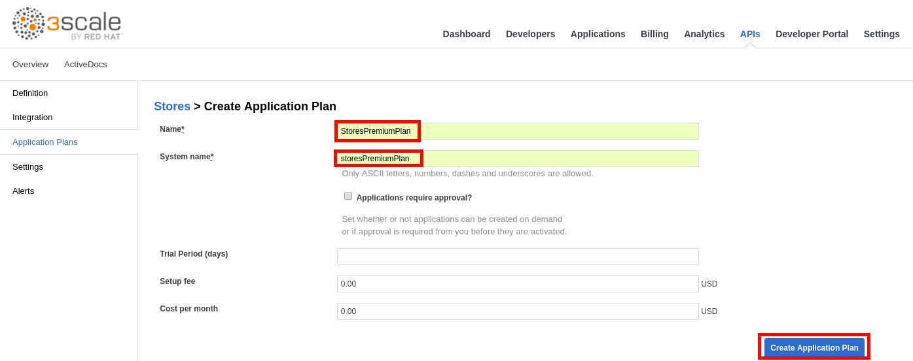

* Click on the **Publish** link.


* Click on the **Developers** tab.
* Click on the **RHBank** account.

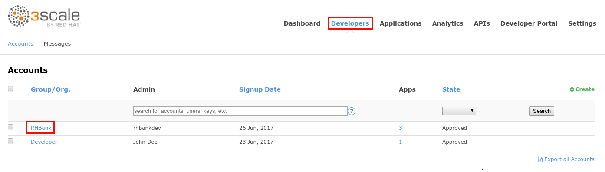

* Click on the **3 Applications** Breadcrumb.
* Click on the **Create Application** link.

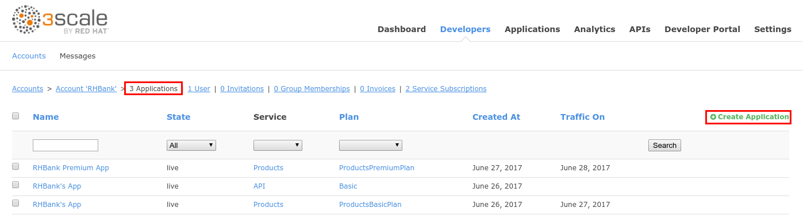

* Select the **StoresPremiumPlan**.
* Enter the following values:
    * **Name**: storesApp
    * **Description**: Stores Application

* Click on the **Create Application** button.


* Click on the **Stores** API link.

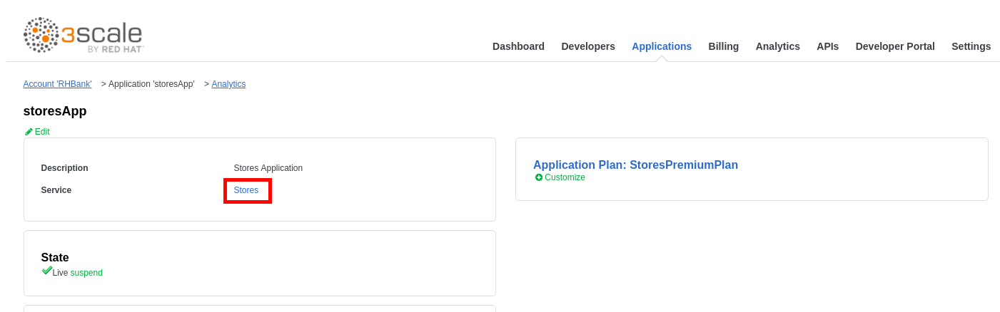

* Click on the **Integration** tab.
* Click on the **add the base URL of your API and save the configuration** button.

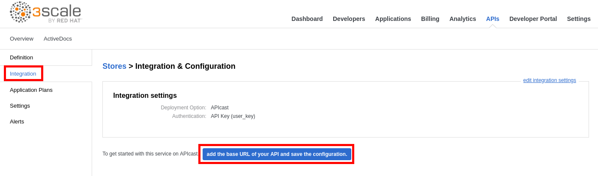

* Enter the following values:

    * **Private Base URL**: http://stores-fis.{{ book.suffix }}
    * **Staging Public Base URL**: https://stores-apicast-staging.3scale.{{ book.suffix }}
    * **Production Public Base URL**: https://stores-apicast-production.3scale.{{ book.suffix }}
    * **API test GET request**: /allstores
    * **Policy Chain**: CORS

* Click on the **Update &amp; test in Staging Environment** button.

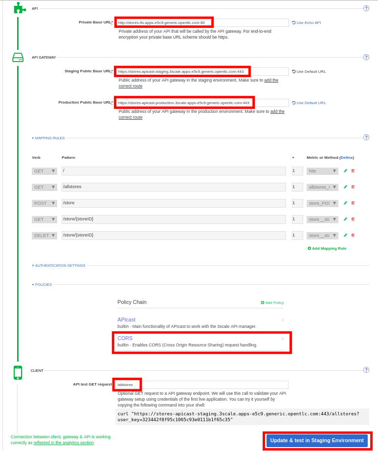


You should receive a successful validation.


* Click on the **Back to Integration &amp; Configuration** link.

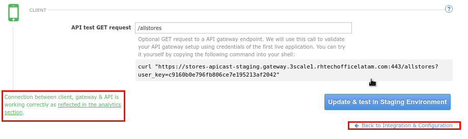

* Click on the **Promote v1 to Production** button.

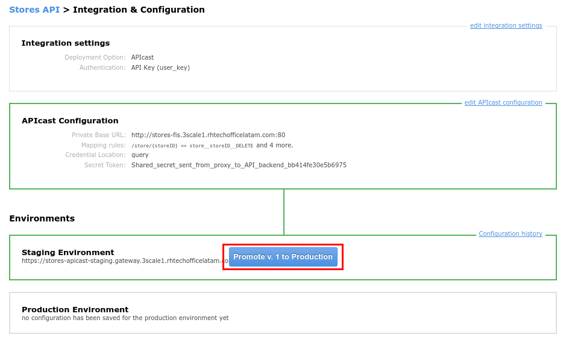

* Click on the **ActiveDocs** tab.
* Click on the **Edit** icon for the **Stores** spec.

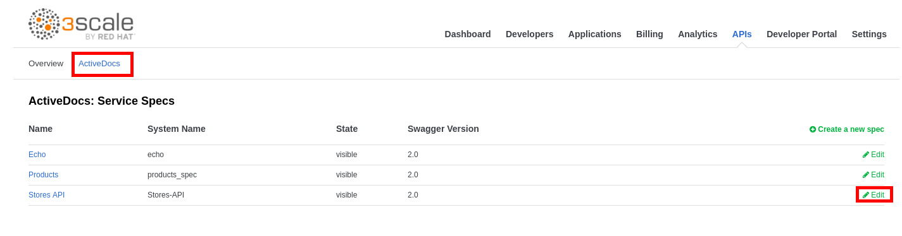

* Change the host attribute to: **stores-apicast-production.3scale.{{ book.suffix }}**
* Change the scheme from _http_ to _https_.
* For each of the _four_ **user_key** parameters, add the following attribute: 

```
,"x-data-threescale-name": "user_keys"

```

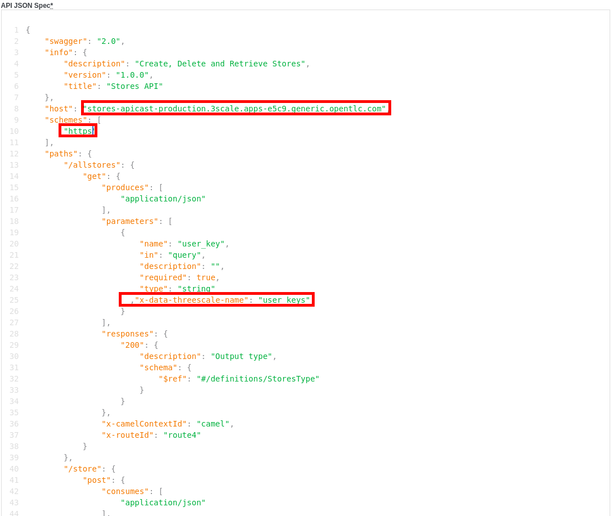

* Scroll down to the bottom of the page and click on the **Update Service** button.
* Open a web browser tab and go to https://stores-apicast-production.3scale.{{ book.suffix }} and accept the SSL certificate.
* Close the tab and go back to the **Stores** API ActiveDoc.
* Expand the **/allstores** operation.
* Click on the **user_key** parameter field and select the **storesApp** user key.
* Click on the **Try it out!** button.



You should receive a JSON document with a list of stores.


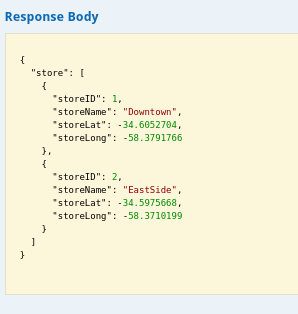