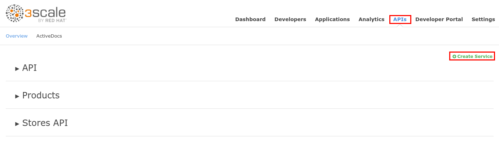
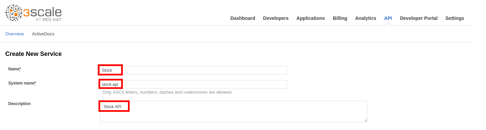
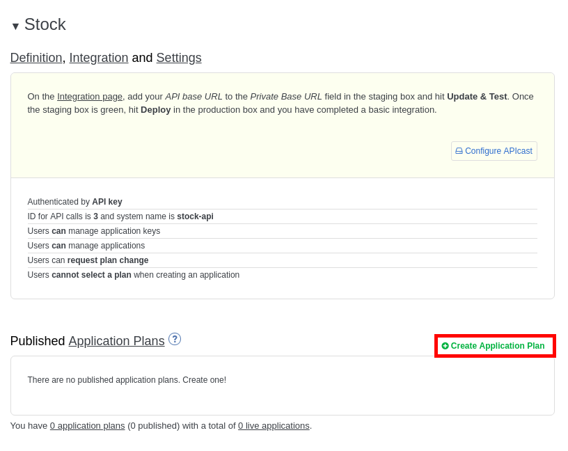
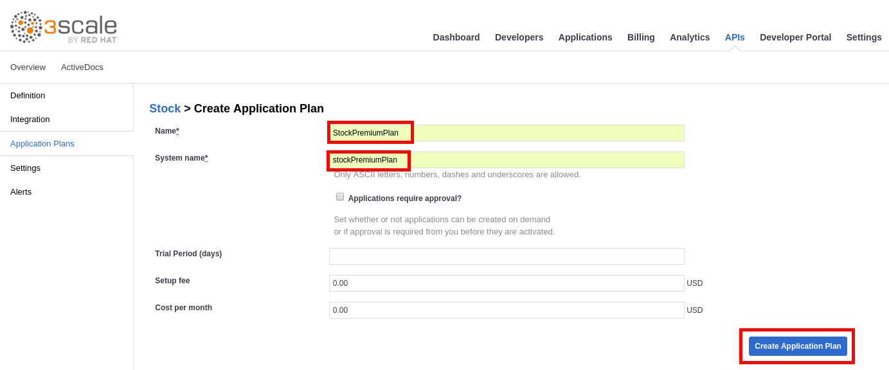
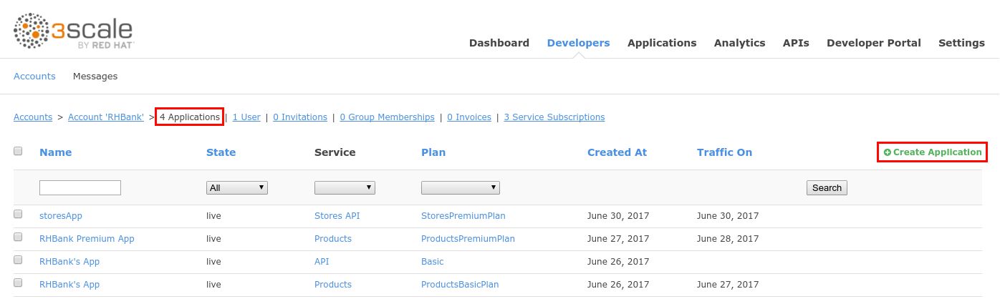
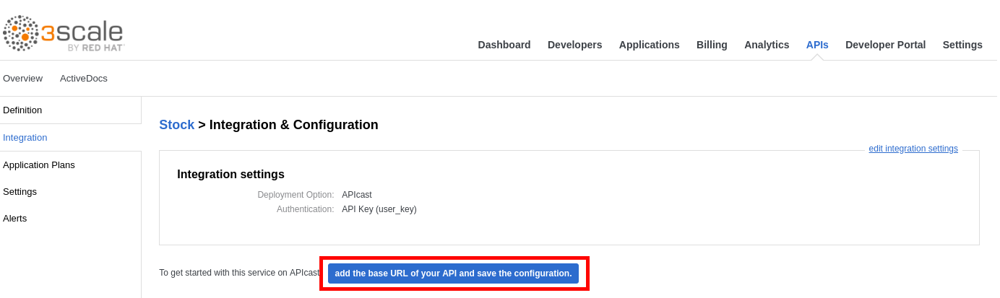
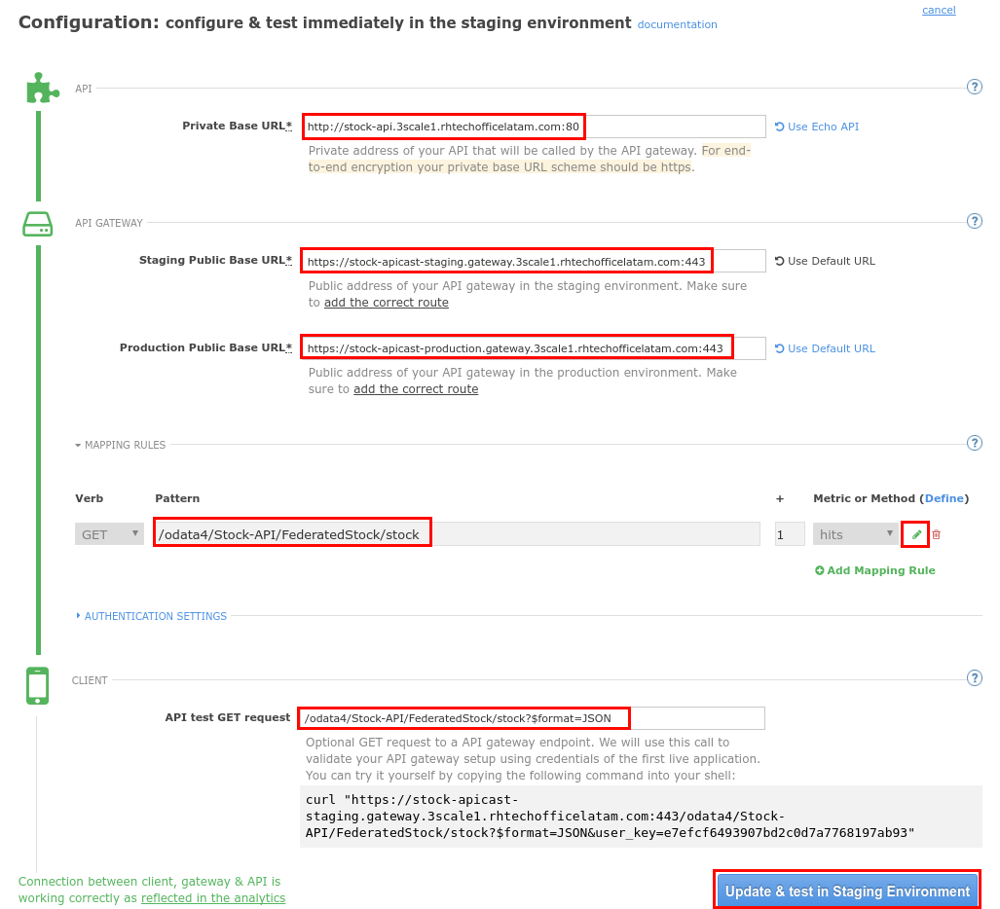
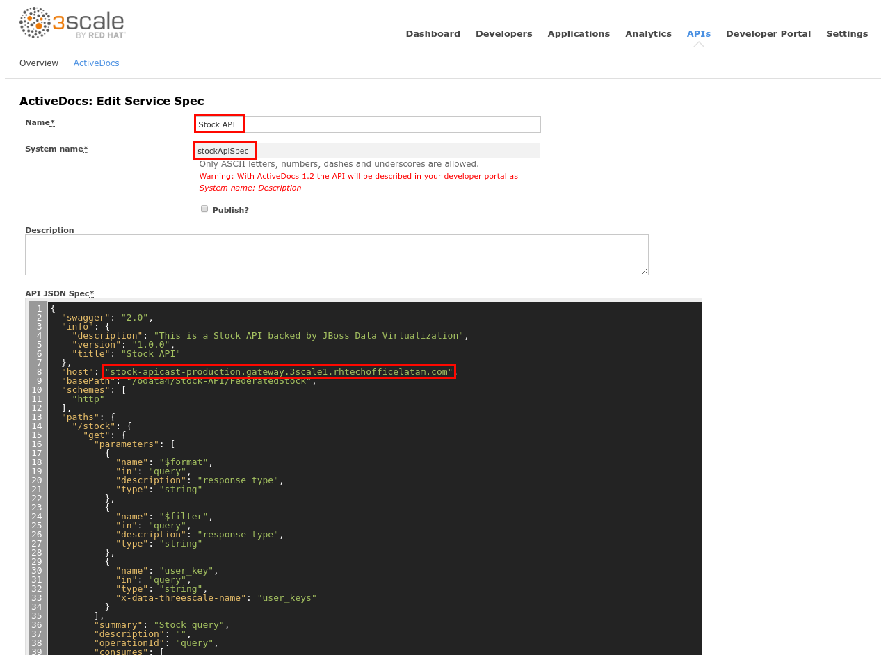
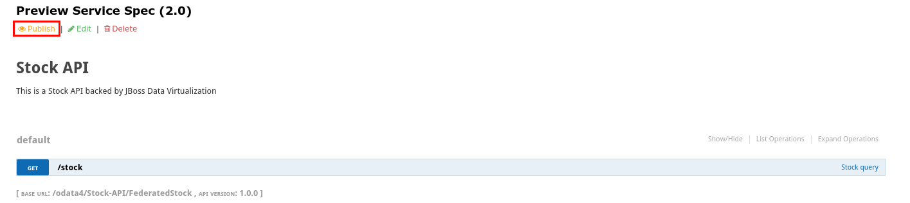
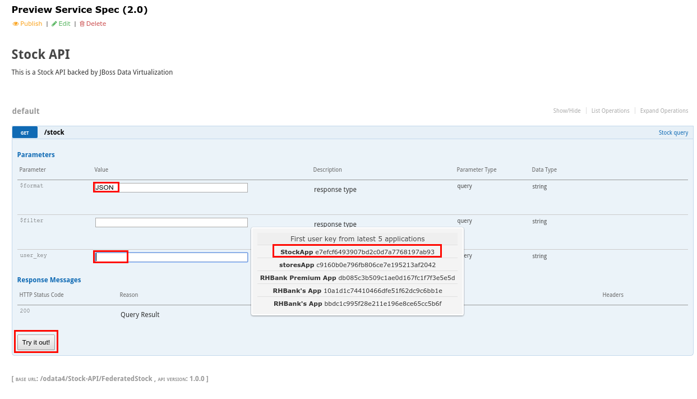

# Lab 8 - Exposing an OData Service with JDV {#lab-8-exposing-an-odata-service-with-jdv}


In this lab you will deploy an OData service based on a JBoss DataVirtualization for Openshift (JDV) virtual database (VDB).  This VDB has a virtual view that retrieves data from two databases’ tables (MySQL and PostreSQL) and present them as a single SQL ANSI table. Then, out of the box, this view is exposed in JDV as an OData REST service. You can find more info about JDV here: https://www.redhat.com/en/technologies/jboss-middleware/data-virtualization


* Open a web browser and go to https://{{ book.hostname }}:8443/
* Login as admin/admin
* Select the **Stock API** project.
* Click on the **Browse Catalog** button.

* Select the **Stock-API** template.
* Click on the **Next >** button.
* Set the **Custom http Route Hostname** field to: stock-api.{{ book.suffix }}
* Scroll down to the bottom of the page and click on the **Create** button.

* Click on the **Continue to the project overview** link.
* After ~5min, a **JBoss Data Virtualization** service will be deployed to OpenShift along with two databases: a **MySQL** and a **PostgreSQL** instance.

* When the three circles are blue, open a new web browser tab and go to http://stock-api.{{ book.suffix }}/odata4/Stock-API/FederatedStock/stock?$format=JSON.


You should receive a JSON document with Stock information coming from the Virtual DataBase(VDB) deployed in the JBoss Data Virtualization container. The VDB has a stock table with federated data from the mysql and postgresql databases.



JDV is a data integration tool that allows you to connect to different data sources in real time and present a unified SQL view to the data consumer. (more info: https://www.redhat.com/en/technologies/jboss-middleware/data-virtualization
)


* Go to https://3scale-admin.3scale.{{ book.suffix }} 
* Login as admin/admin
* Click on the **APIs** tab.
* Click on the **Create Service** link.

* Enter the following values:

| Parameter | Value |
| --- | --- |
| **Name** | Stock |
| **System Name** | stock-api |
| **Description** | Stock API |

* Scroll down to the bottom of the page and click on the **Create Service** button.
* Click on the **Create Application Plan** link.

*  Enter the following values:
    * **Name**: StockPremiumPlan
    * **System Name**: stockPremiumPlan

* Click on the **Create Application Plan** button.

* Click on the **Publish** link.
* Click on the **Developers** tab.
* Click on the **RHBank** account.

* Click on the **4 Applications** breadcrumb.
* Click on the **Create Application** link.

* Enter the following values:

| Parameter | Value |
| --- | --- |
| **Application Plan** | StockPremiumPlan |
| **Name** | StockApp |
| **Description** | Stock Application |

* Click on the **Create Application** button.

* Click on the **Stock** API link.
* Click on the **Integration** tab.
* Click on the **add the base URL of your API and save the configuration** button.

* Enter the following values:

    * **Private Base URL**: http://stock-api.{{ book.suffix }}
    *** Staging Public Base URL**: https://stock-apicast-staging.3scale.{{ book.suffix }}
    * **Production Public Base URL**: https://stock-apicast-production.3scale.{{ book.suffix }}

* Click on the **edit** icon next to the **GET** operation under **Mapping Rules**.
* Enter **/odata4/Stock-API/FederatedStock/stock** as the **Pattern**.
* Enter **/odata4/Stock-API/FederatedStock/stock?$format=JSON** in the **API test GET request**.
4.  Click on the **Update &amp; test in the Staging Environment** button.

* Click on the **Back to Integration &amp; Configuration** link.
* Click on the **Promote v.1 to Production** button.


[OData](http://www.odata.org/) URLs in JDV are formed using the following syntax:
/odata[4]/[VDB_Name]/[ModelName]/[ViewName]


* Click on the **ActiveDocs** tab.

* Click on the **Create a new spec** link.
* Enter the following values:
    * **Name**: Stock API
    * **System Name**: stockApiSpec

* Open a new web browser tab and go to [https://raw.githubusercontent.com/pszuster/3ScaleTD/master/Stock/stock-api-swagger.json](https://raw.githubusercontent.com/pszuster/3ScaleTD/master/Stock/stock-api-swagger.json)
* Copy the contents of the json file (Ctrl+A, Ctrl+C).
* Close the browser tab.
* Paste the json file to the **API JSON Spec** field.
* Change the **host** attribute to stock-apicast-production.3scale.{{ book.suffix }}

1.  Scroll down to the bottom of the page and click on the Create Service button.
2.  Click on the Publish button.

1.  Open a web browser tab.
2.  Go to https://stock-apicast-production.gateway.3scale[your instance #].rhtechofficelatam.com/odata4/Stock-API/FederatedStock/stock
3.  Accept the SSL Certificate.
4.  Close the tab and go back to 3Scale’s tab.
5.  Expand the /stock operation.
6.  Enter JSON in the $format field.
7.  Click on the user_key field and select the StockApp user key.
8.  Click on the Try it out! button.

1.  You should receive an OData JSON document.
2.  Enter “productid eq 1” in the $filter field.
3.  Click on the Try it out! button.

1.  You should receive an OData filtered JSON document.

|  | The $filter field specifies a “WHEN” condition for the query, “productid” is one of the columns of the virtual view, and “eq 1” means “=1”. |
| --- | --- |