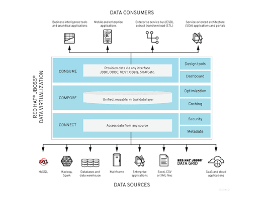

# Lab 8 - Exposing an OData Service with JDV {#lab-8-exposing-an-odata-service-with-jdv}


In this lab you will deploy an OData service based on a JBoss DataVirtualization for Openshift (JDV) virtual database (VDB).  This VDB has a virtual view that retrieves data from two databases’ tables (MySQL and PostreSQL) and present them as a single SQL ANSI table. Then, out of the box, this view is exposed in JDV as an OData REST service. You can find more info about JDV here: https://www.redhat.com/en/technologies/jboss-middleware/data-virtualization


