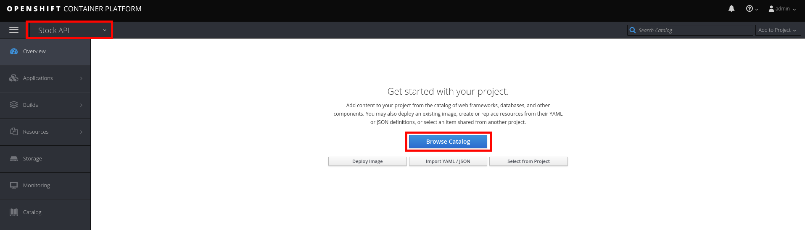
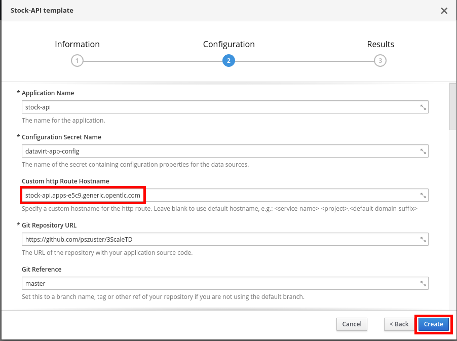
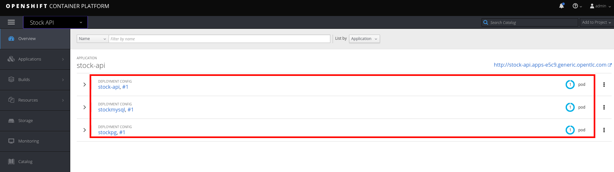
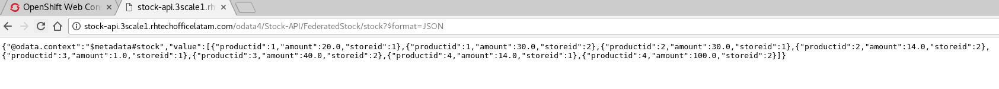

## Deploy the Stock service (JBoss Data Virtualization)

* Open a web browser and go to https://{{ book.hostname }}:8443/
* Login as admin/admin
* Select the **Stock API** project.
* Click on the **Browse Catalog** button.

* Select the **Stock-API** template.
* Click on the **Next >** button.
* Set the **Custom http Route Hostname** field to: **stock-api.{{ book.suffix }}**
* Scroll down to the bottom of the page and click on the **Create** button.

* Click on the **Continue to the project overview** link.
* After ~5min, a **JBoss Data Virtualization** service will be deployed to OpenShift along with two databases: a **MySQL** and a **PostgreSQL** instance.

* When the three circles are blue, open a new web browser tab and go to http://stock-api.{{ book.suffix }}/odata4/Stock-API/FederatedStock/stock?$format=JSON.


You should receive a JSON document with Stock information coming from the Virtual DataBase(VDB) deployed in the JBoss Data Virtualization container. The VDB has a stock table with federated data from the mysql and postgresql databases.



JDV is a data integration tool that allows you to connect to different data sources in real time and present a unified SQL view to the data consumer. (more info: https://www.redhat.com/en/technologies/jboss-middleware/data-virtualization
)


