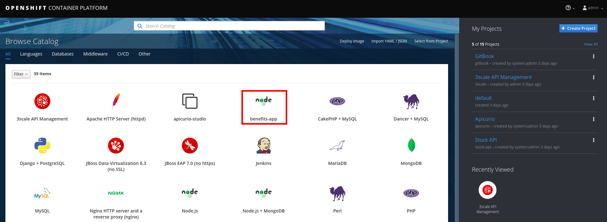
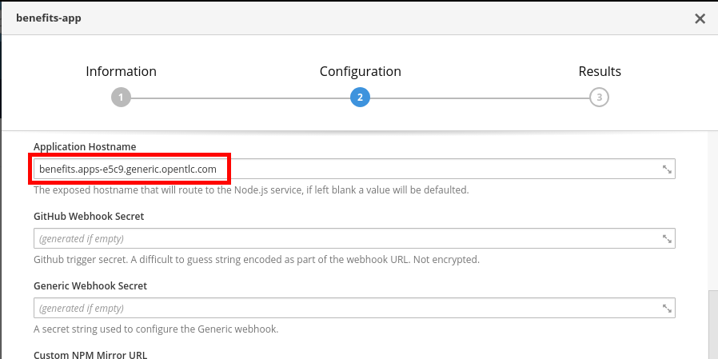
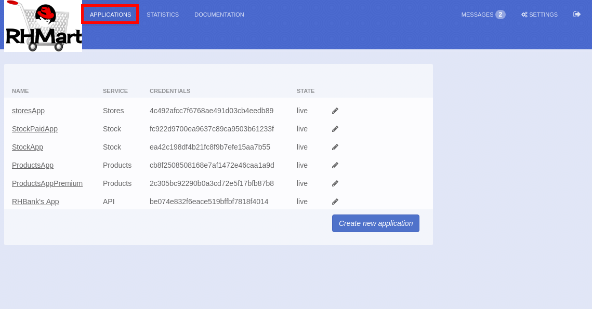

## Deploy the Sample Application


The Benefits web app, will first invoke the Products API’s “getAll” operation to retrieve the entire list of products. Then, when the user clicks on a product, it will invoke the Stock API’s “stock” operation filtered by productid, which will return the list of store ids,with their amount of stock available. Finally the app will invoke the Stores API’s “store/{storeID}” operation for each store to retrieve the store’s name and geolocation, to place it on the map.


* Open a web browser and go to https://{{ book.hostname }}:8443
* Login as admin/admin.
* Click on the **benefits-app** template.

* Click on the **Next >** button.
* Select **Create Project**.
* Enter the following values:
    * **Project Name**: benefits
    * **Project Display Name**: Benefits App
    

    
* Scroll down to the middle of the page, and enter:

    * **Application Hostname**: benefits.{{ book.suffix }}
    

* Set the following values:

    * **Products API URL**: https://products-apicast-staging.3scale.{{ book.suffix }}/rest/services/allproducts
    * **Stock API URL**: https://stock-apicast-production.3scale.{{ book.suffix }}/odata4/Stock-API/FederatedStock/stock
    * **Stores API URL**: https://stores-apicast-production.3scale.{{ book.suffix }}/store/

* Open a new web browser tab (don’t close this one!).
* Go to https://3scale.3scale.{{ book.suffix }}
* Login as rhbankdev/rhbank
4. Click on the **Applications** tab.

1. Select and copy the User Key.

1. Go back to the Openshift console tab.
2. Paste the user key, in the Products API Key parameter.

1. Go back to the 3Scale dashboard’s browser tab.
2. Click on the Applications tab.
3. Click on the storesApp application.
4. Select and copy the User Key.

1. Switch back to the Openshift console browser tab.
2. Paste the user key to the Stores API Key.

1. Go back to the 3Scale dashboard’s browser tab.
2. Click on the Applications tab.
3. Click on the StockApp application.
4. Select and copy the User Key.

1. Switch back to the Openshift console browser tab.
2. Paste the user key to the Stock API Key.

1. Click on the Create button.
2. Click on the Continue to overview link.
3. After ~2min, there should be a nodeJS container deployed to Openshift.