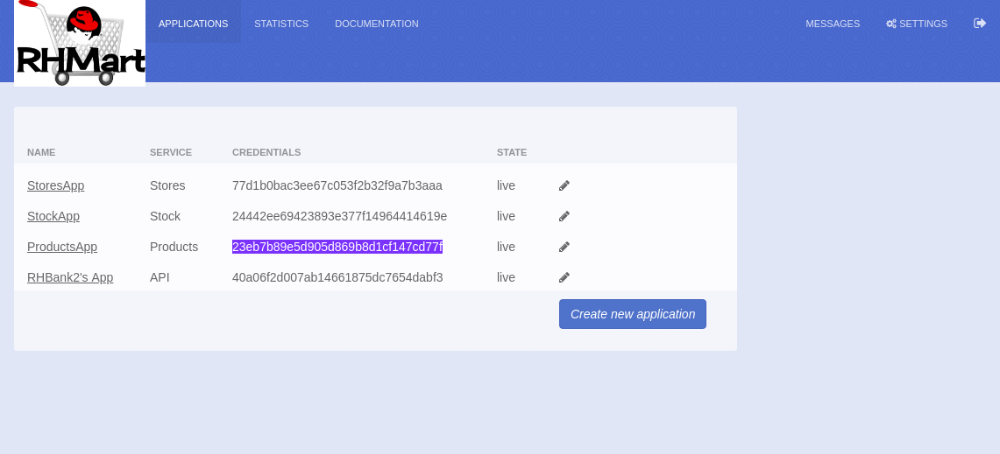
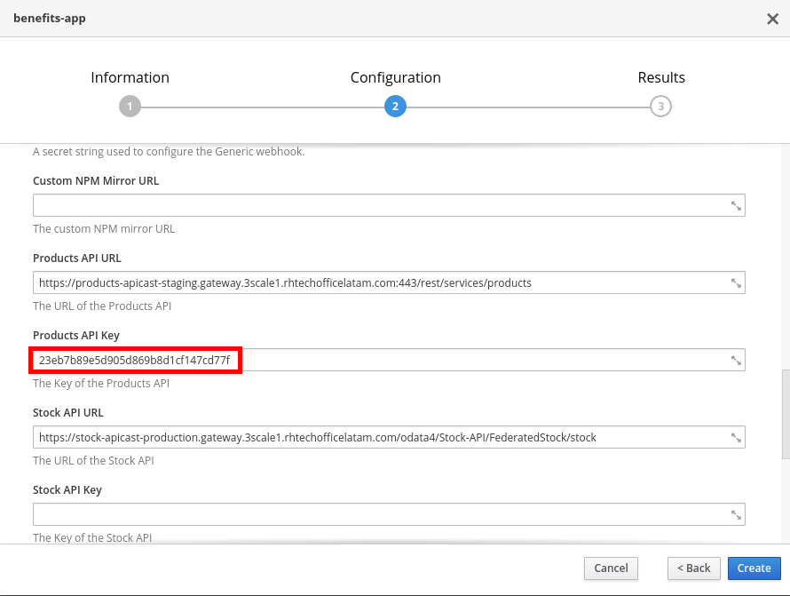

## Deploy the Sample Application


The Benefits web app, will first invoke the Products API’s “getAll” operation to retrieve the entire list of products. Then, when the user clicks on a product, it will invoke the Stock API’s “stock” operation filtered by productid, which will return the list of store ids,with their amount of stock available. Finally the app will invoke the Stores API’s “store/{storeID}” operation for each store to retrieve the store’s name and geolocation, to place it on the map.


* Open a web browser and go to https://{{ book.hostname }}:8443
* Login as admin/admin.
* Click on the **benefits-app** template.

* Click on the **Next >** button.
* Select **Create Project**.
* Enter the following values:
    * **Project Name**: benefits
    * **Project Display Name**: Benefits App
    

    
* Scroll down to the middle of the page, and enter:

    * **Application Hostname**: benefits.{{ book.suffix }}
    

* Set the following values:
    * **Products API URL**: https://products-apicast-staging.3scale.{{ book.suffix }}/rest/services/allproducts
    * **Stock API URL**: https://stock-apicast-production.3scale.{{ book.suffix }}/odata4/Stock-API/FederatedStock/stock
    * **Stores API URL**: https://stores-apicast-production.3scale.{{ book.suffix }}/store/

* Go back to the developer portal web browser tab.
* Copy the **API Key** for the **Products Application**.

* Go back to Openshift web console and paste it in the **Products API Key** field.

* Repeat these steps for the **Stores** and **Stock** APIs.
* Click on the **Create** button.
* Click on the **Continue to the project overview** link.
* After ~2min, there should be a nodeJS container deployed to Openshift.