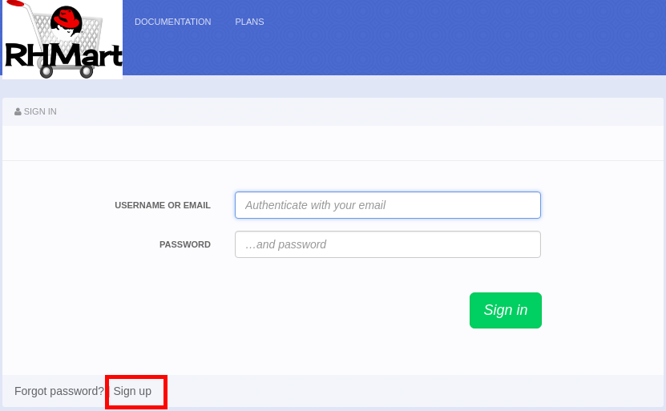
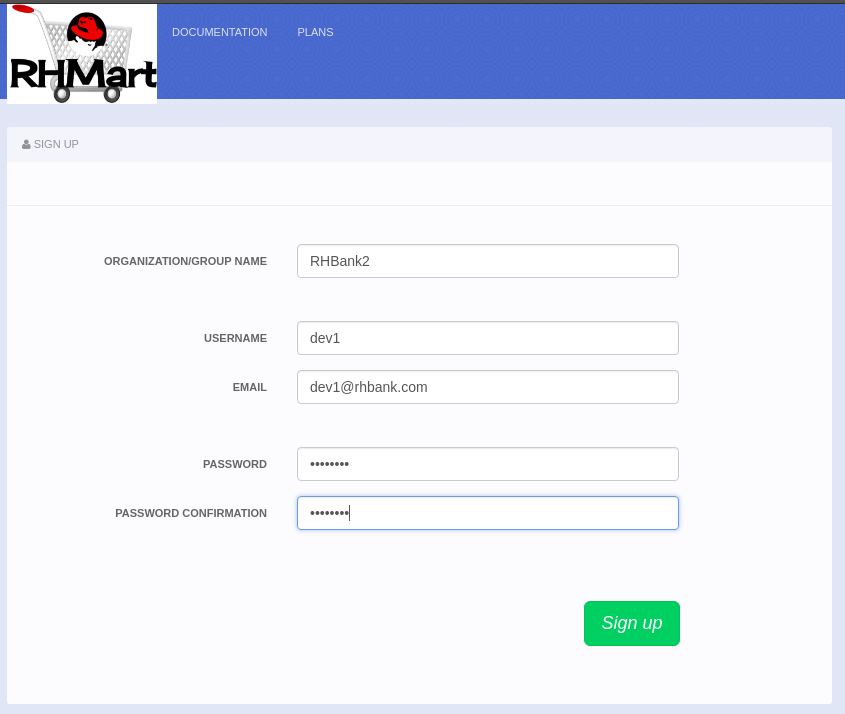
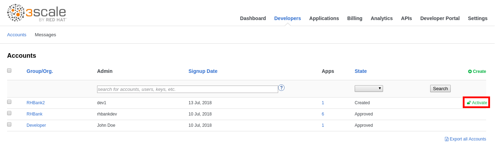
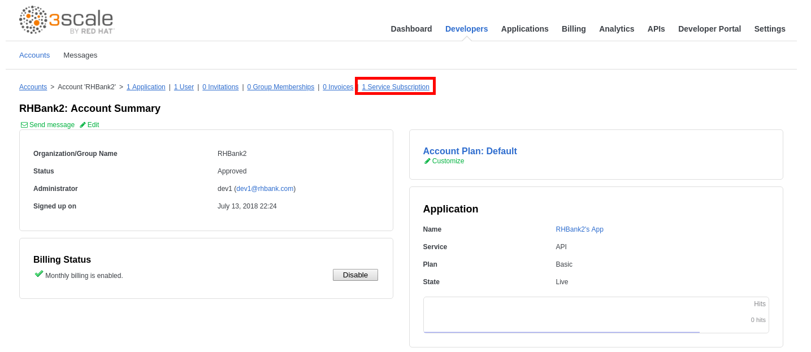
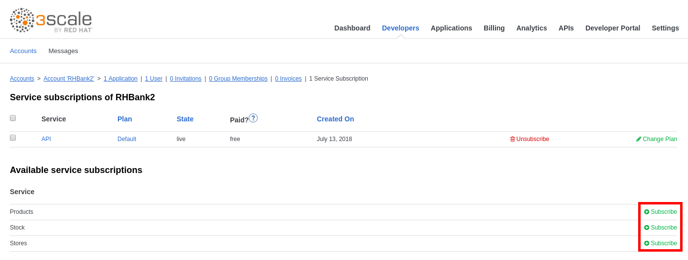
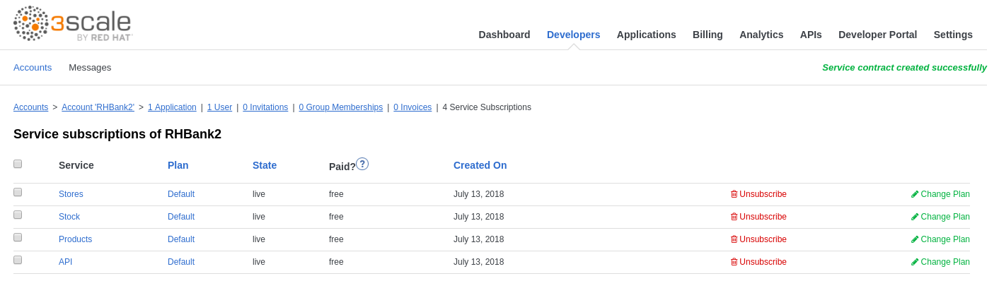

## Developer Workflow


Now you will play the roles of the API consumer and API provider to reproduce a typical real-life scenario.


### As API Consumer

* Open a new web browser tab (don’t close this one!).
* Go to https://3scale.3scale.{{ book.suffix }}
* Click on **SIGN IN**.
* Click on **Sign up**.

* Enter the following values:

| Parameter | Value |
| --- | --- |
| **Organization/Group Name** | RHBank2 |
| **Username** | dev1 |
| **Email** | dev1@rhbank.com |
| **Password** | password |
| **Password Confirmation** | password |

* Click on the **Sign Up** button.

### As API Provider

* Go back to 3scale admin console browser tab.
* Click on the **Developers** tab.
* Click on **Activate** next to account **RHBank2**.

* Click on the **RHBank2** account.
* Click on the **1 Service Subscription** link.

* Click on the **Subscribe** link for the **Products** API.

* Select the **Default Plan**.
* Click on the **Create Subscription** button.
* Repeat these steps for the **Stores** and **Stock** APIs.

