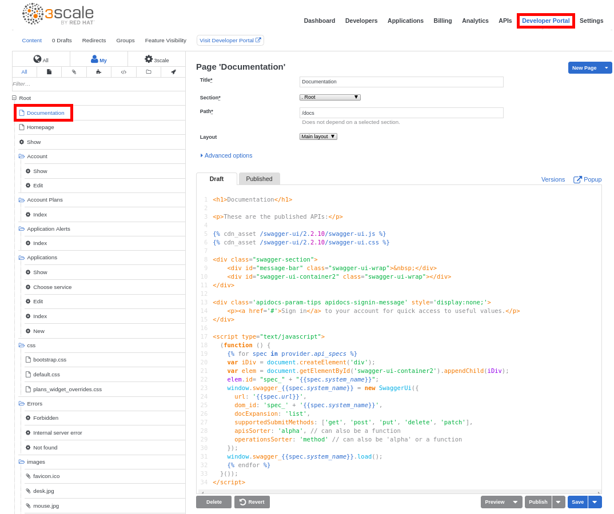
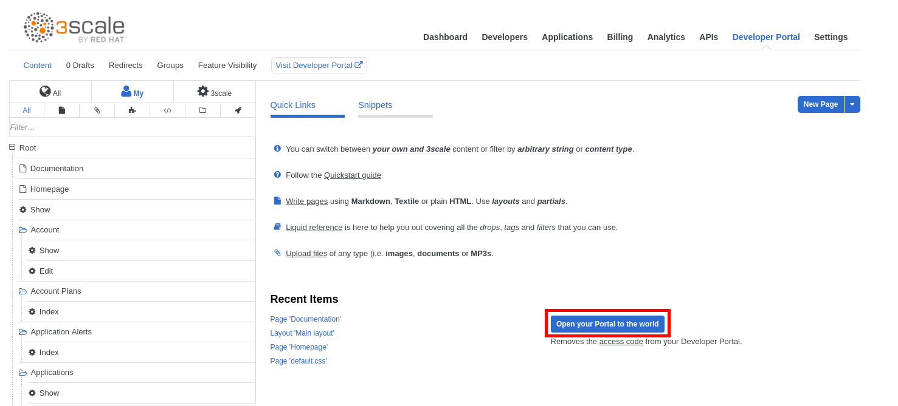

## Display the documentation for all the defined APIs

* Open a web browser and go to https://3scale-admin.3scale.{{ book.suffix }}
* Login as admin/admin.
* Click on the **Developer Portal** tab.
* Click on the **Documentation** page.



* Replace the entire contents of this page, with the following:

```
<h1>Documentation</h1>

<p>These are the published APIs:</p>




<div class="swagger-section">
    <div id="message-bar" class="swagger-ui-wrap">&nbsp;</div>
    <div id="swagger-ui-container2" class="swagger-ui-wrap"></div>
</div>

<div class='apidocs-param-tips apidocs-signin-message' style='display:none;'>
    <p><a href='#'>Sign in</a> to your account for quick access to useful values.</p>
</div>

<script type="text/javascript">
  (function () {
	
    var iDiv = document.createElement('div');
    var elem = document.getElementById('swagger-ui-container2').appendChild(iDiv);
    elem.id= "spec_" + "{{spec.system_name}}";
    window.swagger_{{spec.system_name}} = new SwaggerUi({
      url: '{{spec.url}}',
      dom_id: 'spec_' + '{{spec.system_name}}',
      docExpansion: 'list',
      supportedSubmitMethods: ['get', 'post', 'put', 'delete', 'patch'],
      apisSorter: 'alpha', // can also be a function
      operationsSorter: 'method' // can also be 'alpha' or a function
    });
    window.swagger_{{spec.system_name}}.load();
    
  }());
</script>
```
* Click on the **Publish** button.
* Click on the **Developer Portal** tab again.
* Click on the **Open your portal to the world** button.



1.  Open a web browser tab and go to [https://3scale.3scale[your instance #].rhtechofficelatam.com](https://www.google.com/url?q=https://3scale.3scale3.rhtechofficelatam.com&sa=D&ust=1530635179445000) 
2.  Click on the Documentation tab.

1.  You should see all your APIs’ documentation in one page. This is what a customer/partner/user of your API would visit to start interacting with you.

