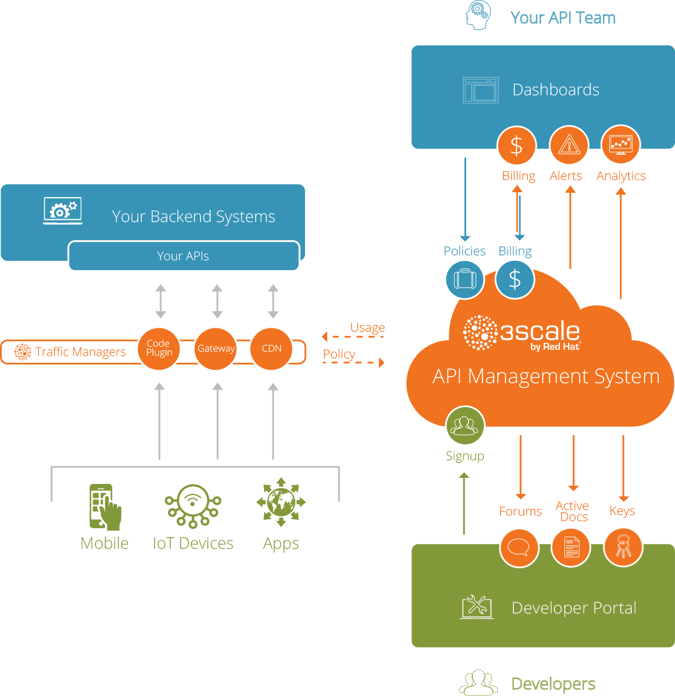
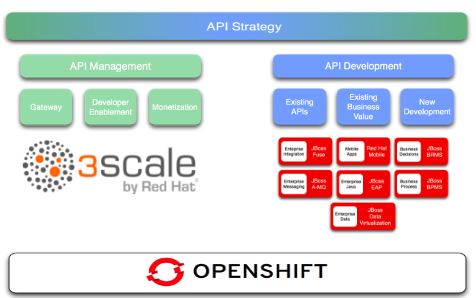

# Red Hat 3Scale API Management Introduction {#red-hat-3scale-api-manager-platform-introduction}

Software is creating a new business reality—the increasing automation of processes, transactions and distribution across every industry and organization. This shift has to do not only with the use of software in particular processes, but also with exposing software interfaces to others—internal developers, partners, customers and the world at large. The result is a transformation for individual businesses that makes them radically more flexible and better able to engage with others. Further, at a global level, this trend heralds a new global business reality—the API Economy.

The one-two-three punch of cloud, mobile and social computing has accelerated the need to put flexible software at the core of what organizations do, and this requires APIs (Application Programming Interfaces) to universally access an organization’s core systems and resources. By exposing data, business processes and other services and resources through APIs, organizations are creating compelling new business platforms. The API Economy represents a new—but already proven— way of doing business: flexible, powerful, on demand integration with almost any external system.

APIs are likely to be one of the most transformative technologies for business today. However, rolling out a successful API strategy is also a complex endeavor presenting new considerations to take into account:

• How should different APIs be exposed and to whom?

• How should those services be secured?

• How should their usage be tracked?

• How are access rights managed?

• How do developers, partners and customers establish their identity and get provisioned

for the rights they need for the API?

• How does an organization ensure success for the users of its APIs?

Red Hat 3scale AMP provides API management infrastructure solutions for all of these challenges and helps hundreds of customers, from Fortune 100s to small startups, to run successful API programs.

The company’s solutions include infrastructure for:

*   Access Control and Rate Limits: Restricting usage of APIs to trusted parties only, and enforcing usage quotas by user, by application and on the basis of a wide variety of traffic metrics.

*   Analytics: Tracking API usage across all applications, users, methods and exposed

resources for a complete picture of activity across all exposed APIs.

*   Developer and Partner Portal: Providing sophisticated onboarding systems for

developers, partners and customers interacting with the API, with custom workflows,

documentation, forums and other support, to ensure user success.

*   Billing and Payments: Offering built-in utility-style billing systems and card-payment

systems to enable charging for API usage, if desired.

*   Comprehensive APIs for all functionality: Providing API access for all of 3scale’s own services and hence the ultimate flexibility for integrating them with existing processes.

Red Hat also has tools to help create and deploy the services that form the APIs exposed in 3Scale AMP. It offers a broad portfolio of Middleware products that you can use to develop your APIs in a robust but light and agile way.

